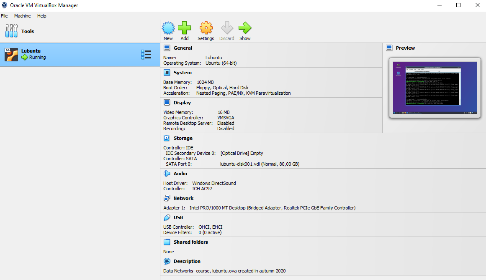
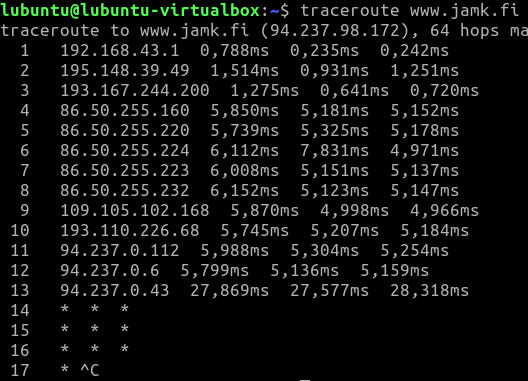
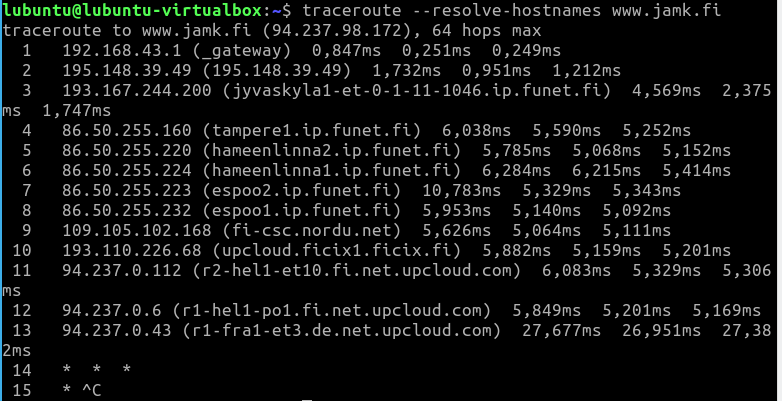
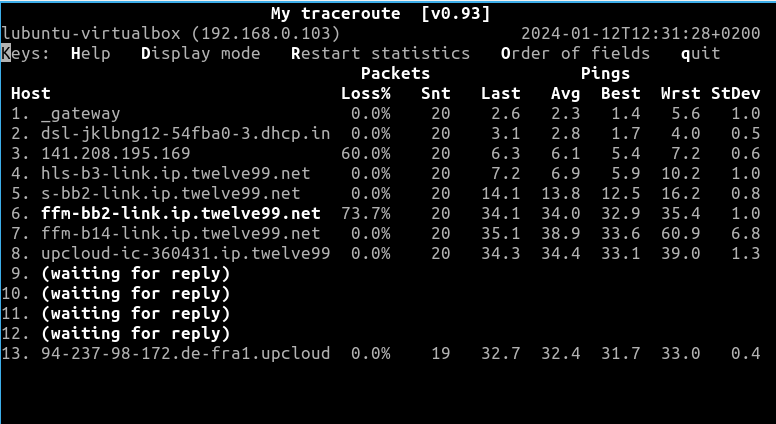
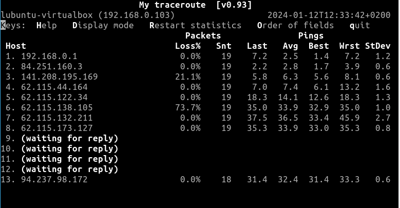

# Documentation for E01

Start here...

## Tehtävä 1

Loin uuden Lubuntun Oracle VM Virtual Boxilla

## Kysymys 1

Mihin tätä virtuaalikonetta voi käyttää ilman verkkoyhteyttä? Mitä voit tehdä sillä?
-> Virtuaalikonetta voi käyttää ilman verkkoyhteyttä ohjelmiston testaamiseen. Voin harjoitella esimerkiksi Linuxin käyttöä turvallisessa ympäristössä.
Onko tietokoneilla mitään tarkoitusta ilman yhteyttä tietoverkkoon?
-> Tietokone eng. computer, jossa kantasana compute eli laskea. Tietokone on voimakas laskin.

## Tehtävä 2

Huomataan että virtual machine on kytketty internettin, koska ping paketit saavat yhteyden www.jamk.fi ja saa myös vastauksen

## Tehtävä 3

Huomataan, että traceroute komento toimii myös

Huomataan, että traceroute resolve palauttaa tuloksia ympäri Suomea

## Tehtävä 4

Huomataan, että mtr toimii ja arvot päivittyvät

mtr optiolla -n toimii myös.