# Documentation for E04

## Valmistellaan ympäristö topologiaan

Importataan uusi virtuaalikone (Vyos)

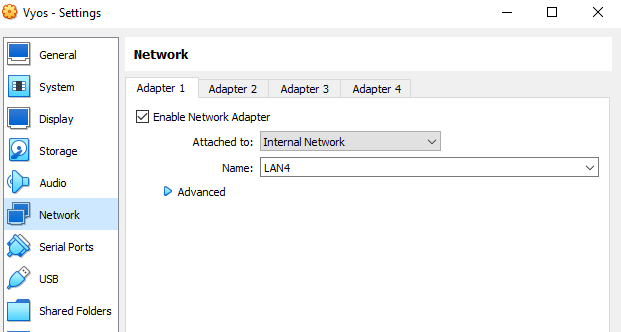

Asetetaan samalla siitä yhteys kytkimeen

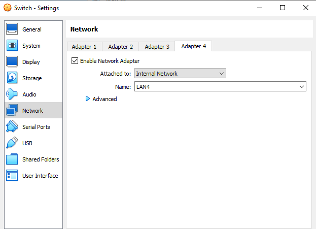

Fyysinen topologia on seuraavanlainen:

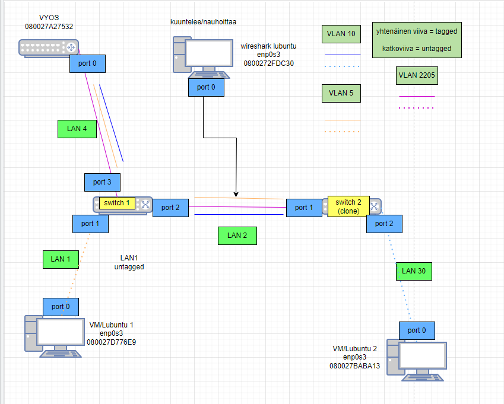

Ja looginen topologia on seuraavanlainen:

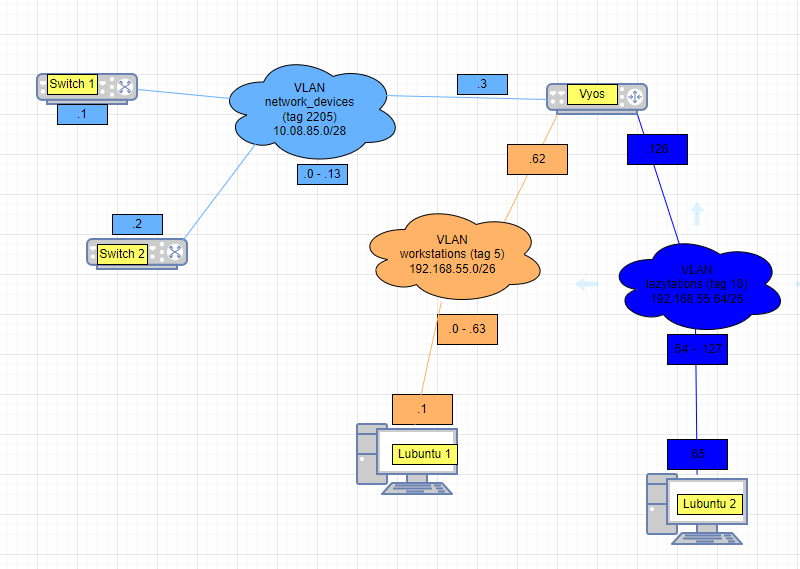

## Konfiguroitiin vyosiin laitteiden ip osoitteita

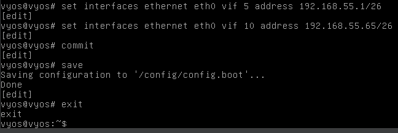

### Osoitteistetaan lubuntut manuaalisesti

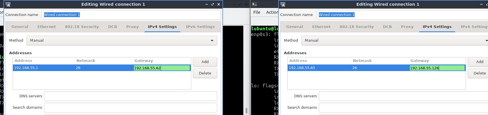

### osoitteistetaan kytkimet

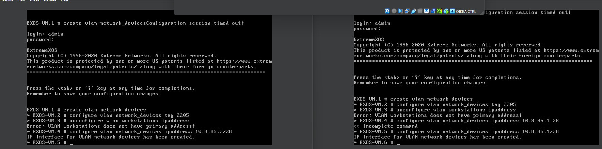

## konfiguraatiot

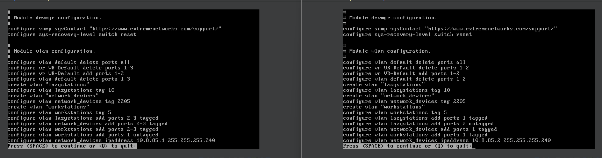

vasen on switch 1 ja oikea on switch 2

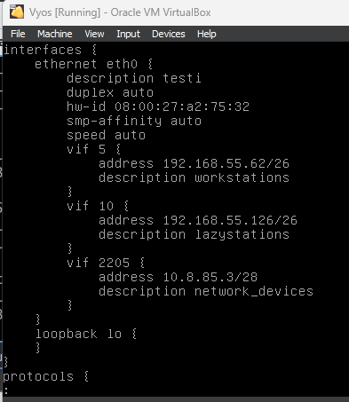

### Tallennetaan konfiguraatiot kytkinten .cfg tiedostoihin

## Testataan yhteydet

### Lubuntu 1 <=> Lubuntu 2

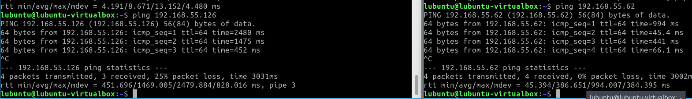

### Lubuntu 1 <=> Vyos

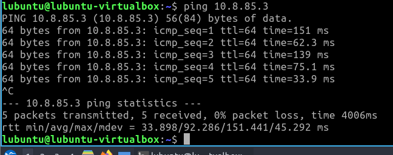

### Lubuntu 2 <=> Vyos

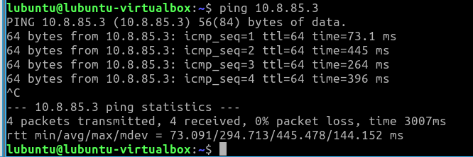

### Lubuntu 1 <=> Switch 1 & Lubuntu 2 <=> Switch 2

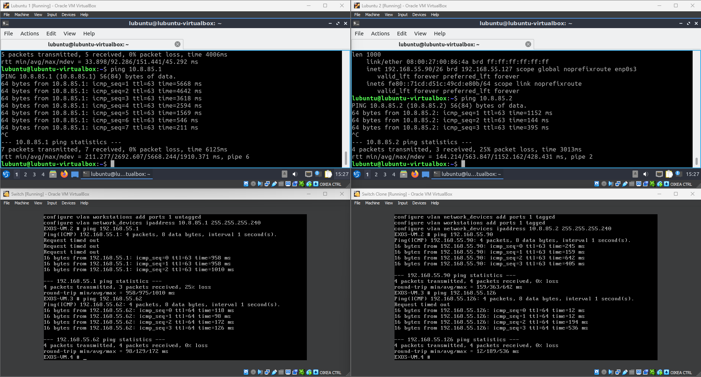

vasen puoli on lubuntu 1 ja switch 1. Lubuntu 1 otaa yhteyden switch 1 ja switch 1 ottaa yhteyden lubuntu 1 rajapintaan

Oikea puoli on lubuntu 2 ja switch 2. Lubuntu 2 ottaa yhteyden switch 2 ja switch 2 ottaa yhteyden lubuntu 2 rajapintaan.
