# Documentation for E07

## Aloitetaan muokkaamalla topologiat

### Fyysinen topologia

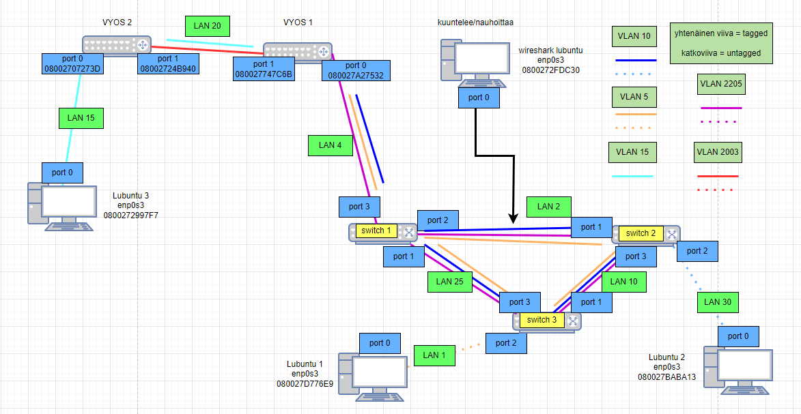

### Looginen topologia

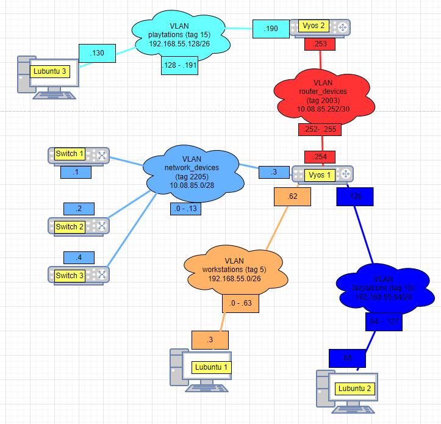

## Uudelleen konfiguroidaan kytkimet 1&2

### Switch 1

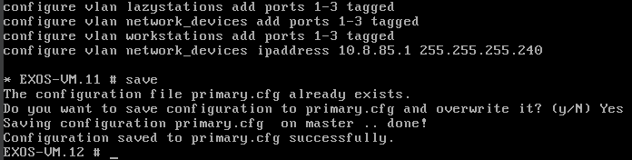

### Switch 2

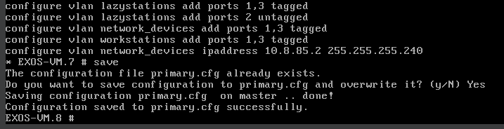

## Siirrettään lubuntu 1 switch 3 taakse

Kytkin 3 on kopioitu kytkimestä 2, joten osa conffauksista pitää poistaa

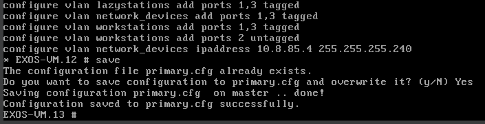

## Yhteystestaukset lubuntuilla oletusyhdyskäytäviin

Harjoituksessa oletetaan, että vyos on kytketty switch 2:een, mutta minulla kun se on switch 1:ssä niin pitää soveltaa sen ympäri.

### Lubuntu 1

Kytkimet ja 1 ja 3 päällä, 2 pois päältä.

Lubuntu 1 ping sen oletusyhdyskäytävään 912.168.55.62

### Lubuntu 2

Kytkimet 1 ja 2 päällä, 3 pois päältä

Lubuntu 2 ping sen oletusyhdyskäytävään 192.168.55.126

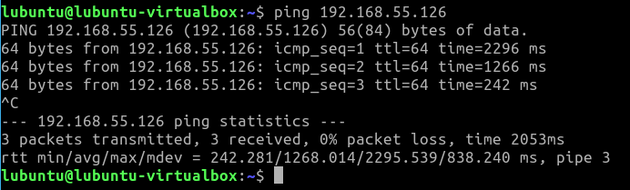

## Silmukka

Ennen silmukan käynmnistämistä tilanne tämä (vertailu mielessä sisällytetty)

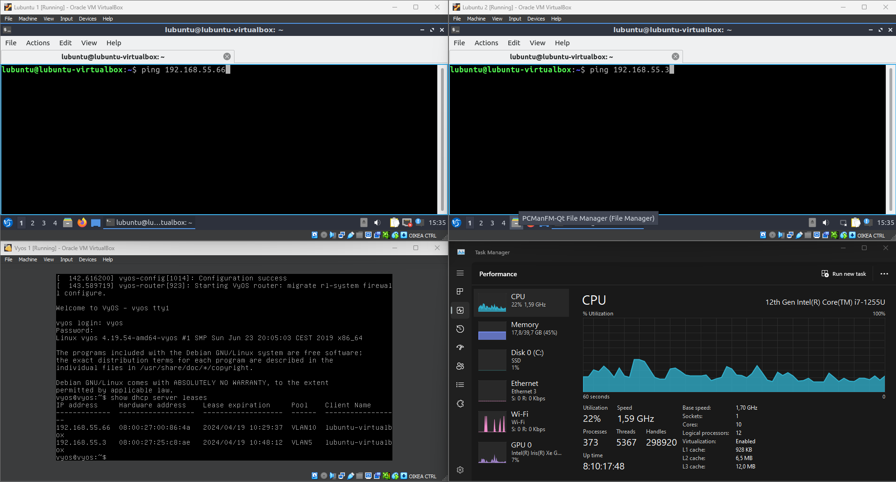

laitetaan silmukka päälle

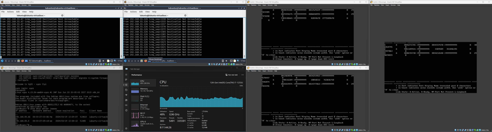

Kuten näkyy on kytkinten packet transmitit pilvissä ja prosessorin käyttöaste on selvästi kohonnut.

## Spanning tree protokolla

konfiguroidaan ja käynnistetään stp kaikissa kytkimissä ja VLANeissa. Kytkin 1 on juurikytkin.

show stpd s0

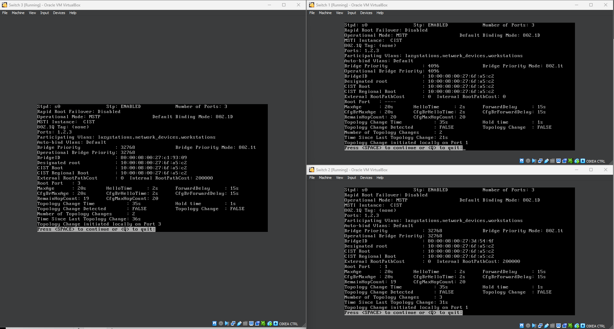

show stpd s0 ports

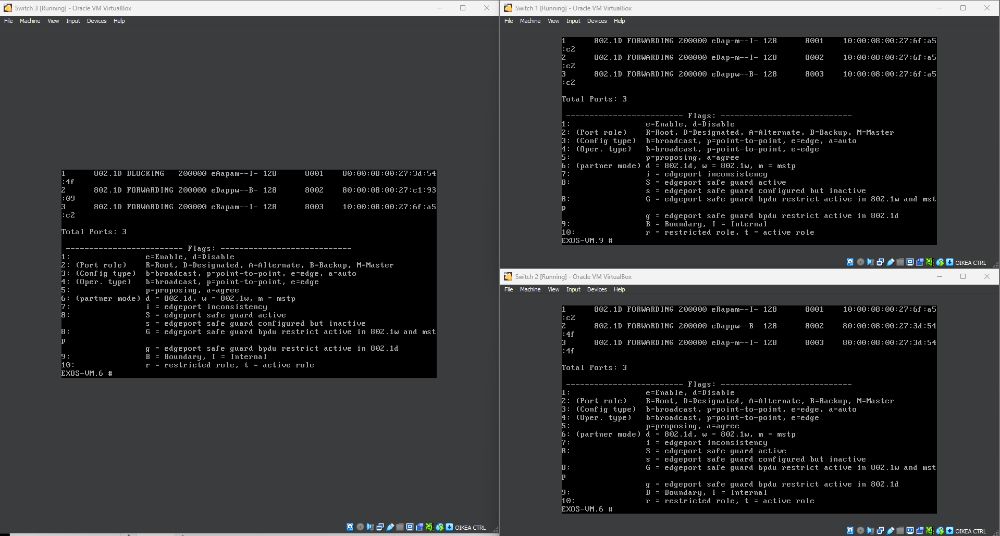

### Lubuntut pingaa kun STP päällä

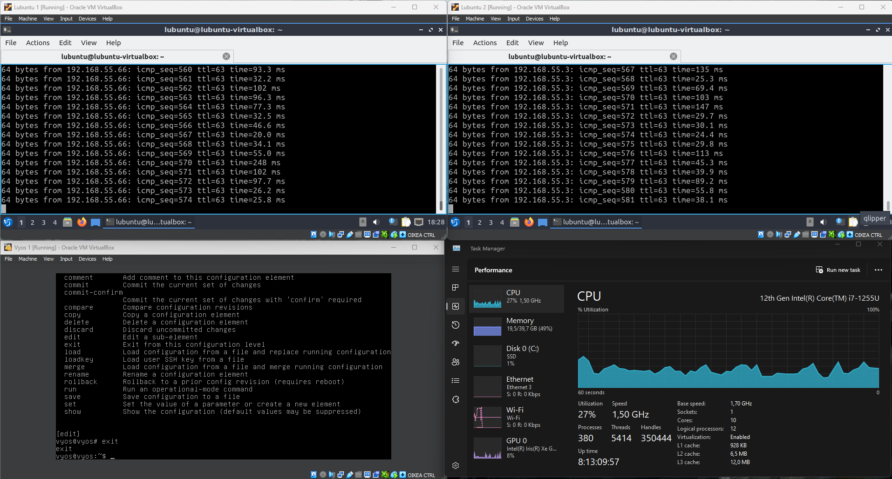

Kuten huomataan, STP helpottaa n. 10 %-yks CPU kuormaa

### STP topologia

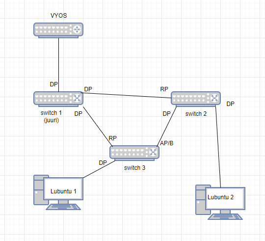

Juurikytkimen sijainti ei ole ihanteellinen nyt koska, jos se hajoaa niin koko verkko menettää pääsyn reitittimeen.

## Päivitetään juurikytkin

Asetetaan switch 1 priorityksi 32768 ja uudelleenkäynnsitetään kaikki kytkimet

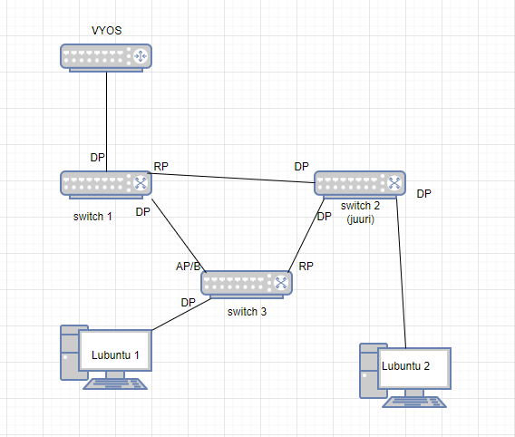

Havaitaan, että switch 2 on uusi juurikytkin.

## Muutosten vaikutukset

Laitetaan lubuntu 1 pingaamaan lubuntu 2:ta

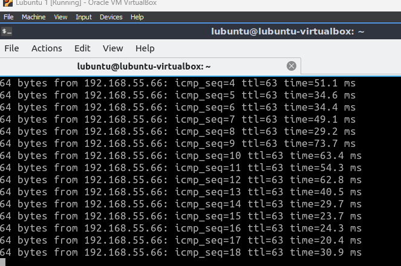

Ping 20-30 ms

sammutetaan switch 3 port 1 (suora yhteys switch 2 kautta lubuntu 2)

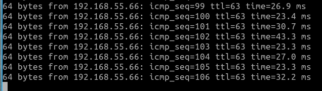

Huomataan, että ping nosuee hetkellisesti ja huomattavasti kun vaihtoehtoinen reitti perille etsitään ja löydetään.
