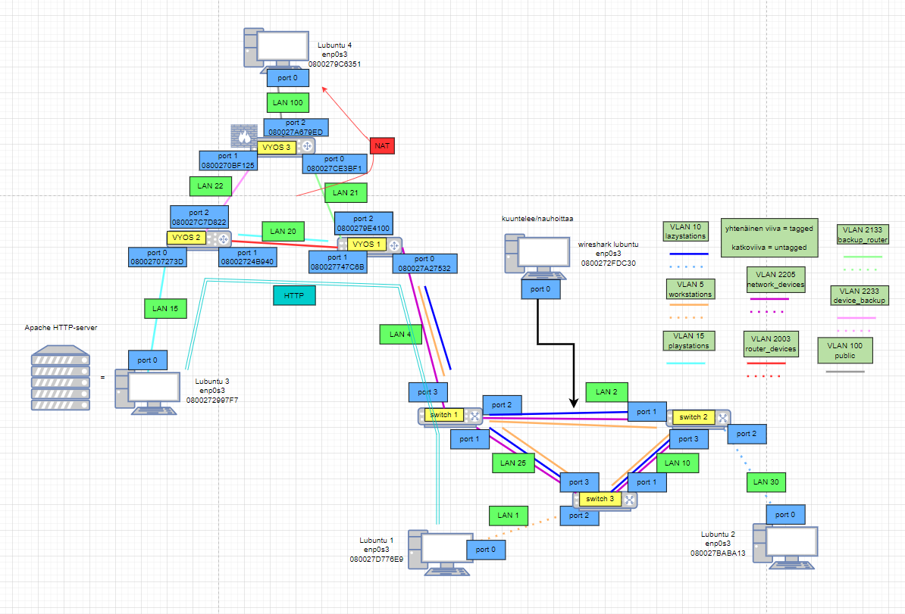
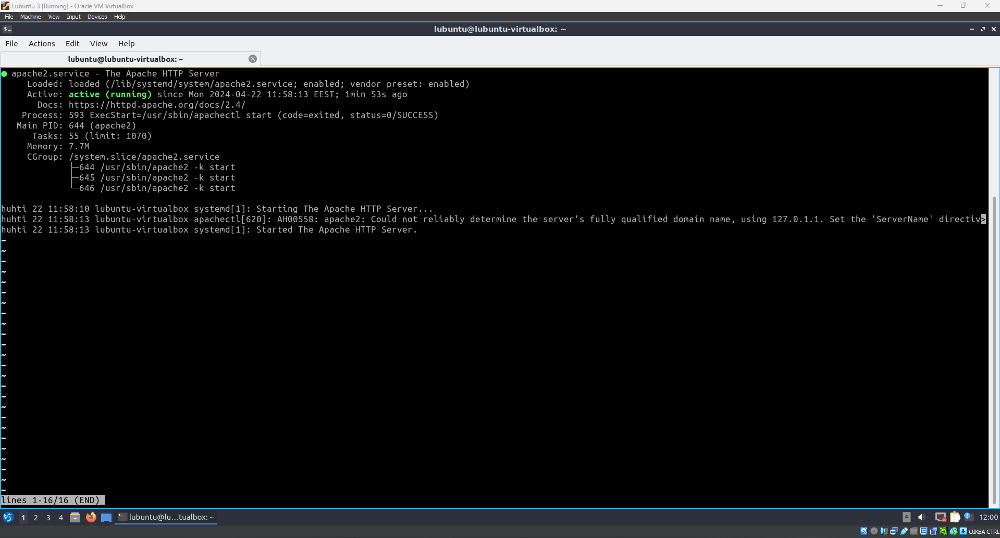
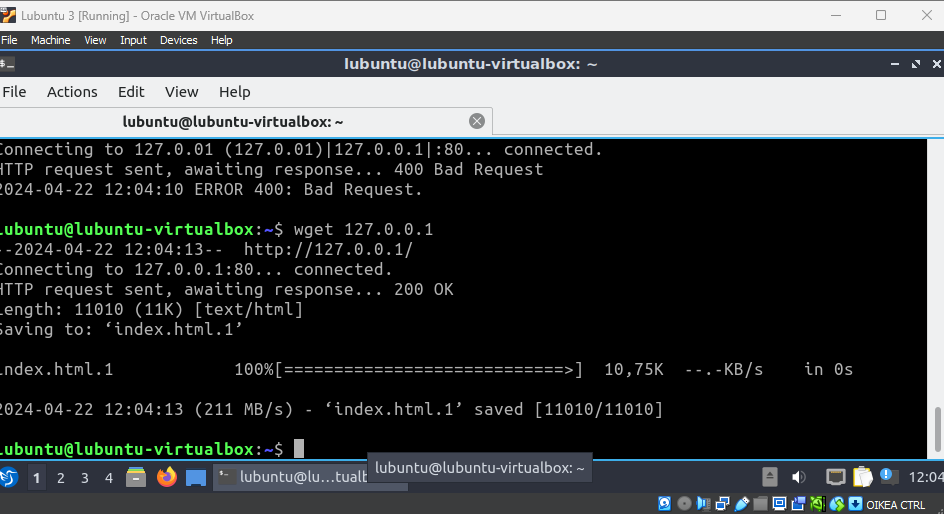
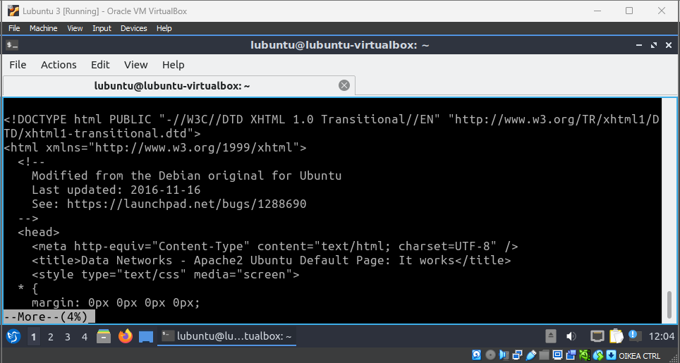
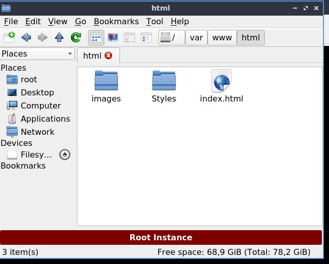
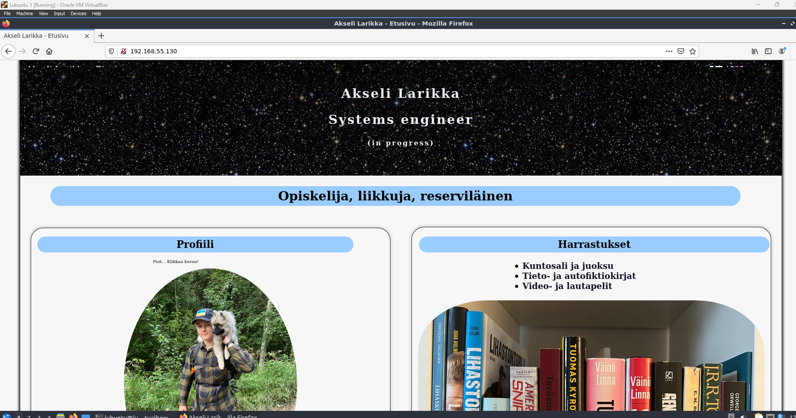
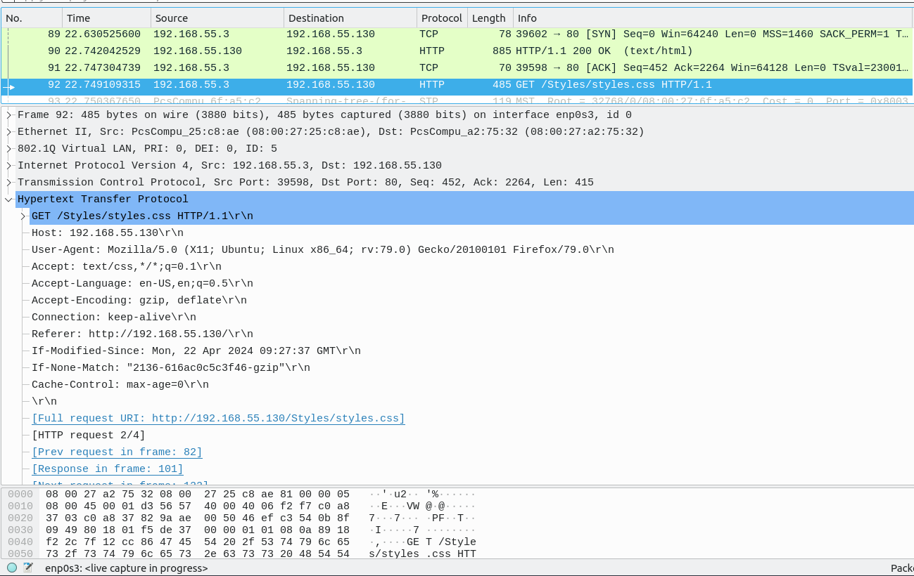

# Documentation for E13

Apachen valmistelu

Topologia, jota lähdetään seuraamaan

Huomataan, akvamariinin värinen putki, jossa lukee "http", tämä siis ludoaan tässä harjoituksessa

## Apache tarkistus

Apache on päällä

## WGET tarkistus

Palvelin löytyy ja siellä on index.html

Index tiedostossa on html sivun perustietoja

## Web palvelimen sisällön muokkaus

Siirretään nyt web tekniikat kurssilla tehty henkilökohtainen verkkosivu palvelimelle.

Siirrytään lubuntulla sijaintiin /var/www/html ja sieltä löytyy tiedosto index.html.

Muokataan tätä tiedostoa NANO-editorilla

Siirretään myös drag&drop toiminnolla kuvaj css tiedostot lubuntulle

Kuten huomataan, lubuntu 1 saa yhteyden palvelimeen ja nettisivu tulostuu oikein

## Wireshark tarkkailu

Laitetaan wireshark kuuntelemaan Vyos 1 ja Switch 1 välistä liikennettä samalla kun päivitetään sivustoa Lubuntu 1:llä

Nähdään GET/Styles/styles.css HTTP/1.1.

Hostina on 192.168.55.130, eli Lubuntu 3:n Apache-serveri, user-agentista nähdään, että sivusto haetaan Mozilla Firefoxin versiolla 79 ja käyttöjärjestelmänä on 64-bittinen Ubuntu. Huomattavaa myös, että Destination port on 80, eli http-protokollan mukainen.

## Konfiguraatiot

Näitä ei tarvinnut tässä tehtävässä muuttaa, niin käytetään samoja kuin edellisessä.

