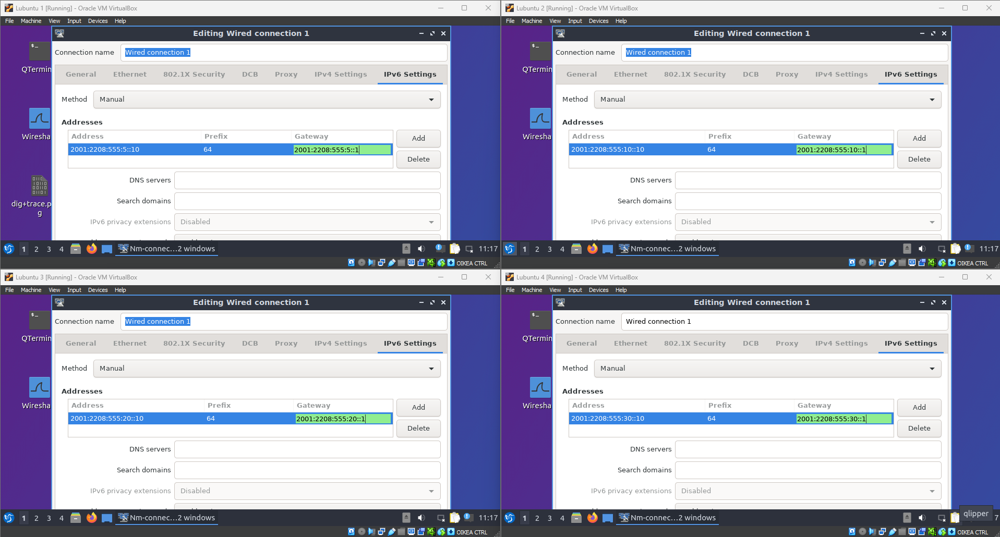
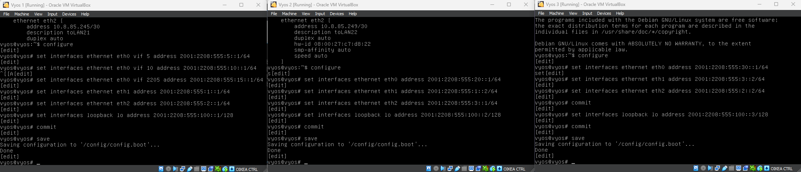
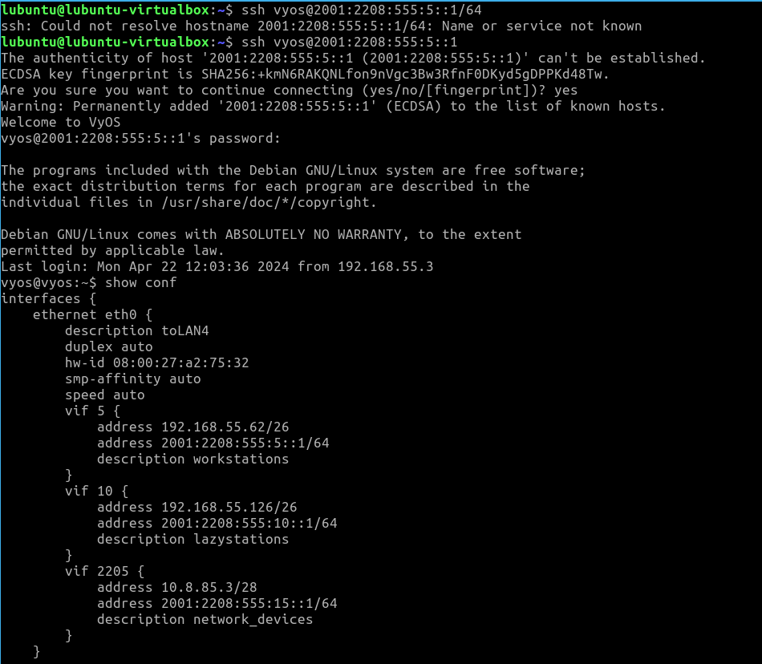
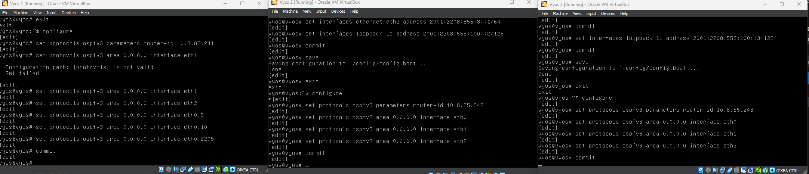
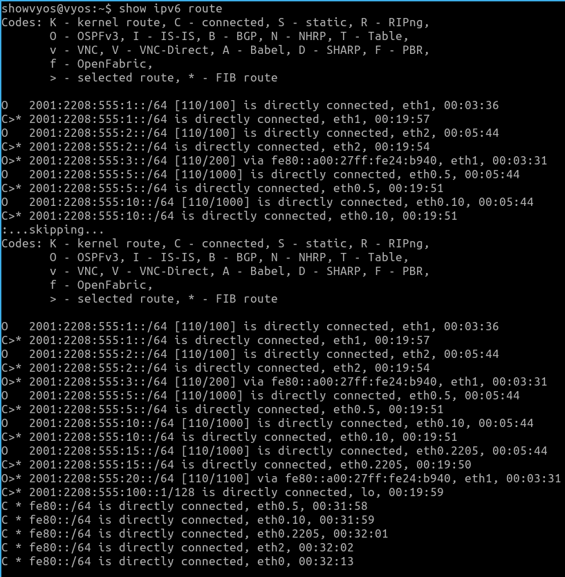
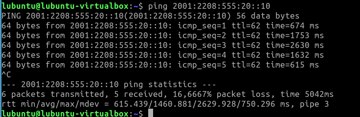
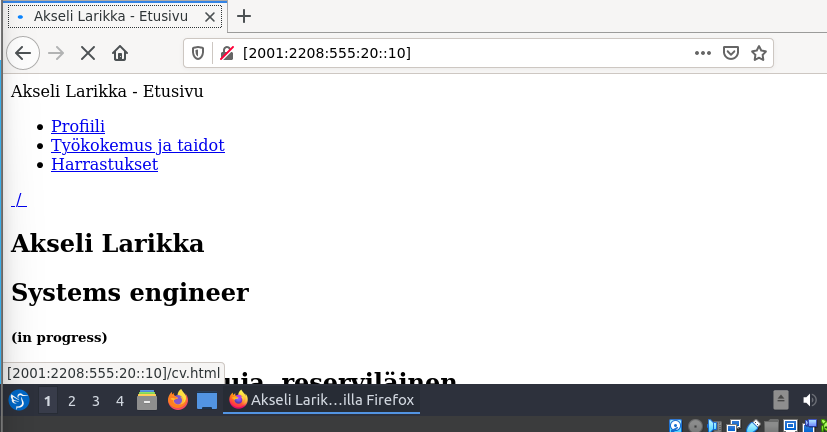

# Documentation for E16

Muistetaan E03:sta...

"Opiskelijanumero on
2208555
ja se on muodossa
vvxyzki"

Muodostetaan sen avulla IPv6 osoite

```
2001:<vvxy>:<zki>:<subnets>::/64
2001:2208:555:<subnets>::/64
```
Kokonaisuudessaan osoite olisi
```
2001:2208:0555:0000:0000:0000:0000:0000
```
Josta 16-bittiä (ensimmäinen 0000) on varattu aliverkkoa varten ja 64-bittiä (jälkimmäiset neljä 0000) hostin osoitetta varten.

Osoiteavaruus kokonaisuudessaan siis olisi 0-ffff

## Päivitetty looginen topologia


## Lisätään IPv6 IP:t

### Lubuntut

Asetetaan IPv6 osoitteet lubuntuille manuaalisesti



### Reitittimet

Esimerkkikomennot (vyos 1)

Komennot:</br>
set interfaces ethernet eth0 vif 5 address 2001:2208:555:5::1/64</br>

set interfaces ethernet eth0 vif 10 address 2001:2208:555:10::1/64</br>

set interfaces ethernet eth0 vif 2205 address 2001:2208:555:15::1</br>

set interfaces ethernet eth1 address 2001:2208:555:1::1/64</br>

set interfaces ethernet eth2 address 2001:2208:555:2::1/64</br>

set interfaces loopback lo address 2001:2208:555:100::1/128



#### Todiste toimivuudesta SSH yhteys IPv6 osoitteella



### OSPFv3 reitittimille

Esimerkkikomennot (vyos 1)

Komennot:</br>
set protocols ospfv3 parameters router-id 10.8.85.241</br>

set protocols ospfv3 area 0.0.0.0 interface eth1</br>

set protocols ospfv3 area 0.0.0.0 interface eth2</br>

set protocols ospfv3 area 0.0.0.0 interface eth0.5</br>

set protocols ospfv3 area 0.0.0.0 interface eth0.10</br>

set protocols ospfv3 area 0.0.0.0 interface eth0.2205



#### Todiste toimivuudesta

show ipv6 route



## Yhteystestaukset

Ping L1-L3



HTTP-serveri



Yhteys muodostuu, vaikka layout onkin hajalla ja kuten pingauksen kohdalla huomasi, niin ping on poikkeuksellisen korkea. Saattanee johtua raudasta softan sijasta, mutta en perehtynyt sen enempää

SSH testattu aiemmin

Traceroute L1-L3


## Konfiguraatiotiedostot reitittimistä


