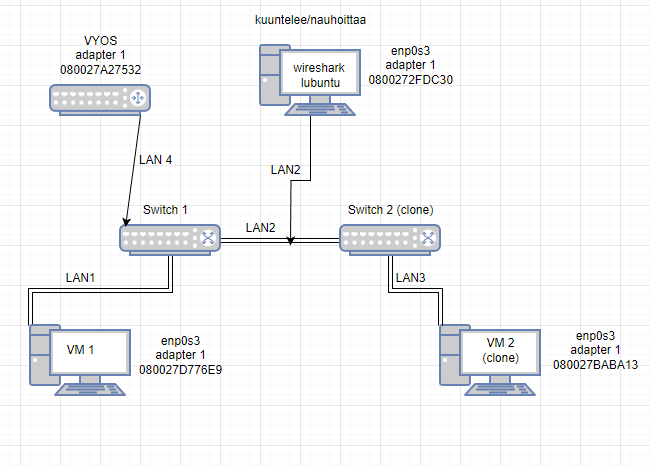

# Documentation for E04

## Valmistellaan ympäristö topologiaan

Importataan uusi virtuaalikone (Vyos)

Asetetaan samalla siitä yhteys kytkimeen

Topologia on seuraavanlainen:

Konfiguroitiin vyosiin laitteiden ip osoitteita

Osoitteistetaan lubuntut manuaalisesti

osoitteistetaan kytkimet

