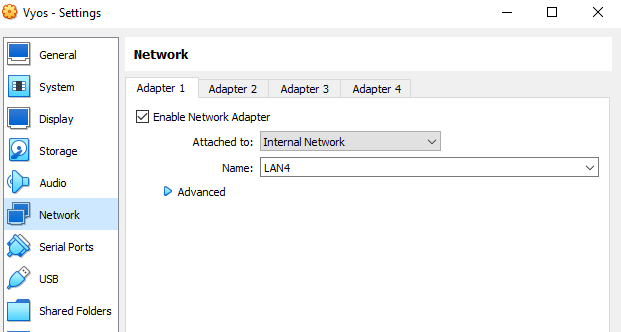
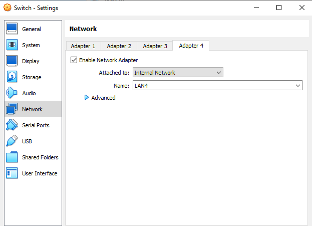
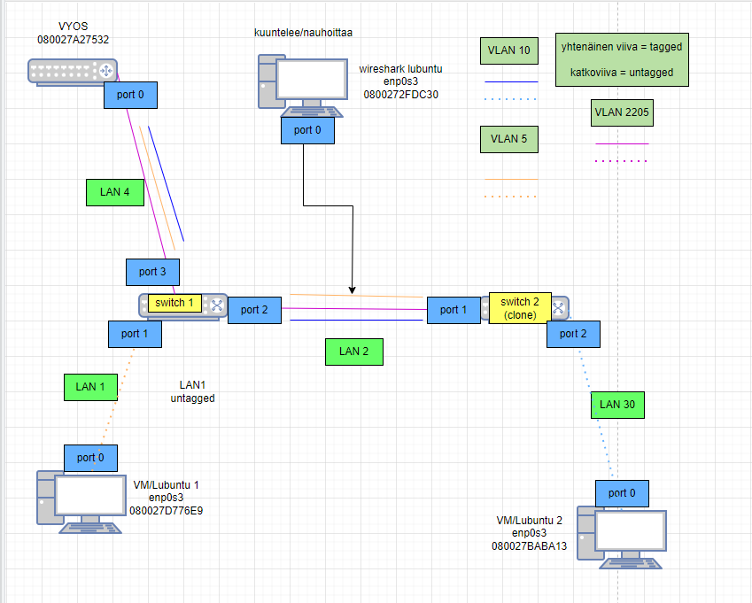
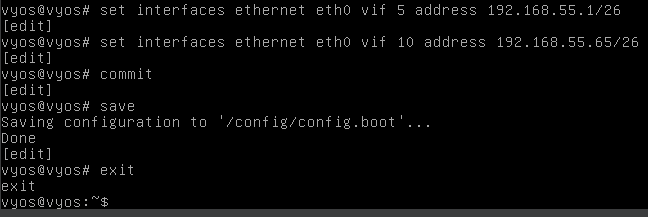
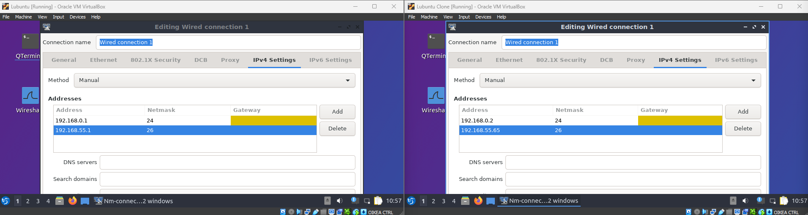
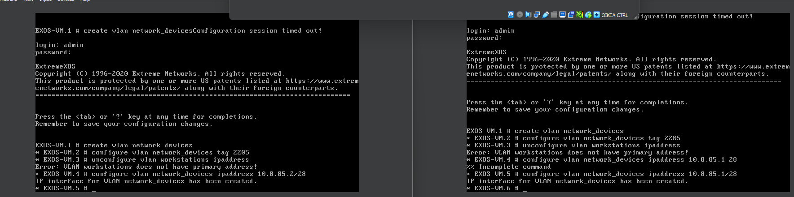
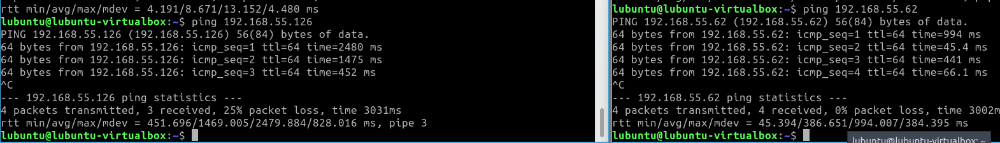
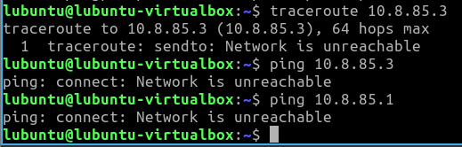
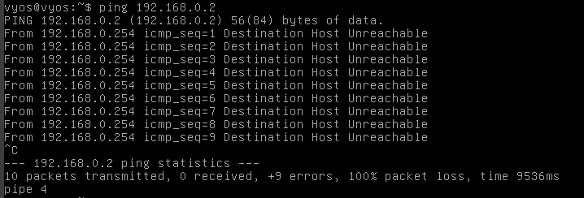

# Documentation for E04

## Valmistellaan ympäristö topologiaan

Importataan uusi virtuaalikone (Vyos)

Asetetaan samalla siitä yhteys kytkimeen

Fyysinen topologia on seuraavanlainen:

Ja looginen topologia on seuraavanlainen:

## Konfiguroitiin vyosiin laitteiden ip osoitteita

### Osoitteistetaan lubuntut manuaalisesti

### osoitteistetaan kytkimet

#### seuraavia komentoja käytetty

### switch 1

create vlan network_devices

configure vlan network_devices tag 2205

unconfigure vlan workstations ipaddress

configure vlan network_devices 10.8.85.2/28

configure vlan network_devices add ports 3 tagged (tämä on VYOSiin vievä portti)

configure vlan network_devices add ports 2 tagged (tämä on switch 2:een vievä portti)

configure iproute add default 10.8.85.3

save

y

### switch 2

create vlan network_devices

configure vlan network_devices tag 2205

unconfigure vlan workstations ipaddress

configure vlan network_devices 10.8.85.1/28

configure vlan network_devices add ports 1 tagged (tämä on switch 1:een vievä portti)

configure iproute add default 10.8.85.3

save

y

### vyos

set interfaces ethernet eth0 vif 2205 address 10.8.85.3/28

commit

save

### Tallennetaan konfiguraatiot kytkinten .cfg tiedostoihin

## Testataan yhteydet

### Lubuntu 1 <=> Lubuntu 2

### Lubuntu <=> Vyos

### Lubuntu <=> Switch

Vaikka Vyosissa ja molemmissa kytkimissä on kaikki asetukset tallennettu ja IP osoitukset näennäisesti oikein (ja tallennettu), ei jostain syystä silti löydy yhteyttä. Kuva on lubuntu 1 ja .3-pääte on VYOS ping ja .1-pääte on switch 1 ping

Tässä kuvassa yritetty VYOSista ottaa yhteys lubuntuun, mutta ei myöskään onnistu
