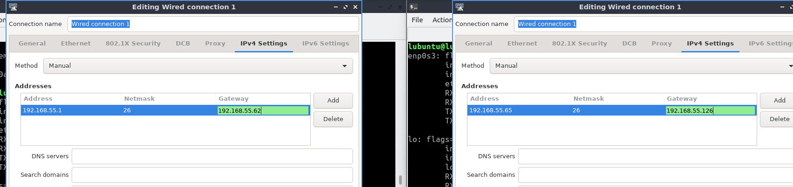
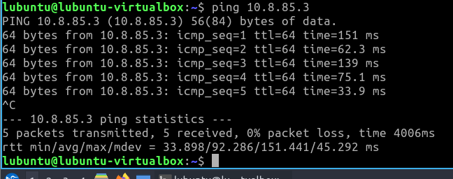
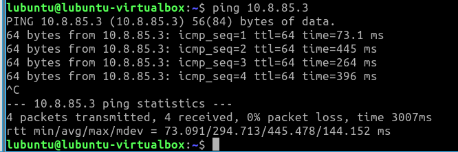
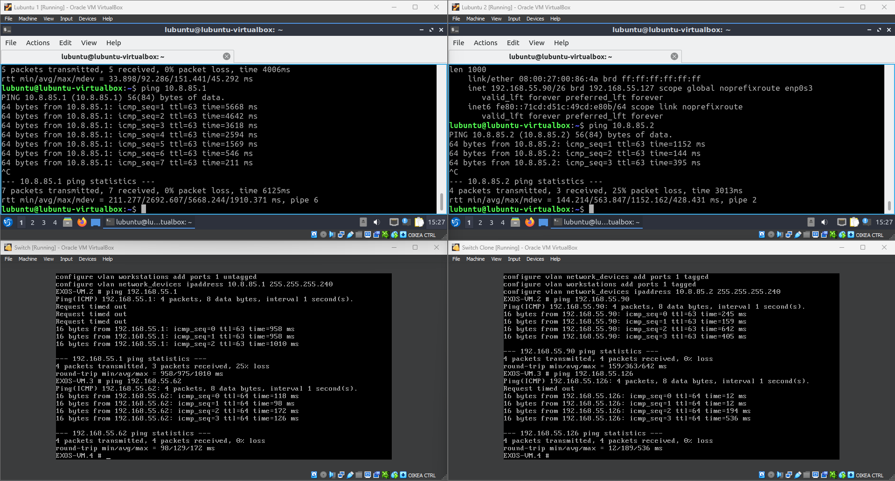
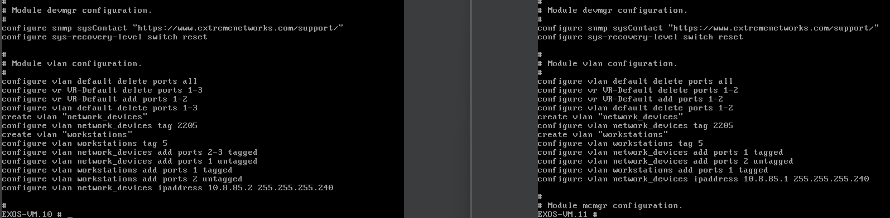
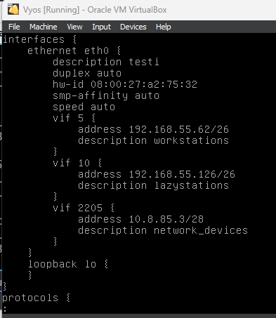

# Documentation for E04

## Valmistellaan ympäristö topologiaan

Importataan uusi virtuaalikone (Vyos)

Asetetaan samalla siitä yhteys kytkimeen

Fyysinen topologia on seuraavanlainen:

Ja looginen topologia on seuraavanlainen:

## Konfiguroitiin vyosiin laitteiden ip osoitteita

### Osoitteistetaan lubuntut manuaalisesti

### osoitteistetaan kytkimet

#### seuraavia komentoja käytetty

### switch 1

create vlan network_devices

configure vlan network_devices tag 2205

unconfigure vlan workstations ipaddress

configure vlan network_devices 10.8.85.2/28

configure vlan network_devices add ports 3 tagged (tämä on VYOSiin vievä portti)

configure vlan network_devices add ports 2 tagged (tämä on switch 2:een vievä portti)

configure iproute add default 10.8.85.3

save

y

### switch 2

create vlan network_devices

configure vlan network_devices tag 2205

unconfigure vlan workstations ipaddress

configure vlan network_devices 10.8.85.1/28

configure vlan network_devices add ports 1 tagged (tämä on switch 1:een vievä portti)

configure iproute add default 10.8.85.3

save

y

### vyos

set interfaces ethernet eth0 vif 2205 address 10.8.85.3/28

set interfaces ethernet eth0 vif 5 address 192.168.55.62/26

set interfaces ethernet eth0 vif 10 address 192.168.55.126/26

commit

save

### Tallennetaan konfiguraatiot kytkinten .cfg tiedostoihin

## Testataan yhteydet

### Lubuntu 1 <=> Lubuntu 2

### Lubuntu 1 <=> Vyos

### Lubuntu 2 <=> Vyos

### Lubuntu 1 <=> Switch 1 & Lubuntu 2 <=> Switch 2

vasen puoli on lubuntu 1 ja switch 1. Lubuntu 1 otaa yhteyden switch 1 ja switch 1 ottaa yhteyden lubuntu 1 rajapintaan

Oikea puoli on lubuntu 2 ja switch 2. Lubuntu 2 ottaa yhteyden switch 2 ja switch 2 ottaa yhteyden lubuntu 2 rajapintaan.

## konfiguraatiot

vasen on switch 1 ja oikea on switch 2

vyosin konfiguraatio, mukana myös muutaman hutilaukauksen tulokset
