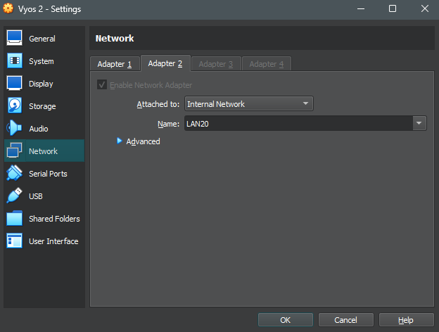
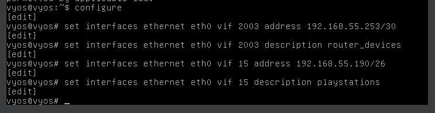
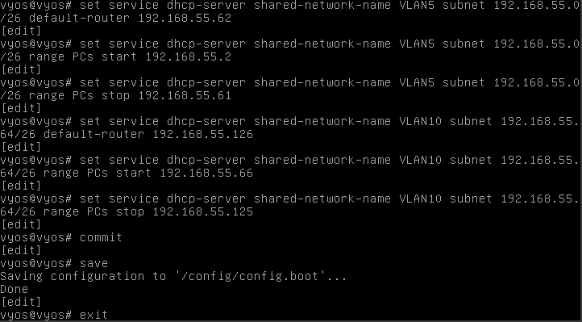

# Documentation for E05

## Luodaan kolmas lubuntu ja toinen vyos

Importattiin uusi lubuntu ja vyos, muunnettiin samalla kaikkien laitteiden nimet loogisiksi

Asetettiin lubuntu 3 ja vyos 2 välinen yhteys adapter 1/port 0 kautta LAN 15 yhteydellä

Asetettiin myös lubuntu 3 ip osoite Automatic (DHCP) methodin mukaan.

Asetettiin vyos 2 ja vyos 1 välinen yhteys adapter 2 /port 1 kautta LAN 20 yhteydellä

## päivitetty fyysinen- ja looginen topologia

### Fyysinen

### Looginen

## Vyosien osoitteistaminen

Ohessa käytetyt komennot, vyos 1 päinvastaiset eikä siinä ole playstations tagia

Vasen on vyos 1 ja oikea on vyos 2. Edellisten sekoilujen tuloksena, hieman ylimääräistä infoa. eth1 on vyos-to-vyos yhteyttä varten ja eth0 kulkee vyoseilta muille laitteille.

## DHCP serverin konfigurointi

### VYOS1

Toistetaan sama operaatio VYOS 2 aliverkolle playstations (tag 15).

### Komentoja

#### VLAN 5

set service dhcp-server shared-network-name VLAN5 subnet 192.168.55.0/26 default-router 192.168.55.62

set service dhcp-server shared-network-name VLAN5 subnet 192.168.55.0/26 range PCs start 192.168.55.2

set service dhcp-server shared-network-name VLAN5 subnet 192.168.55.0/26 range PCs stop 192.168.55.61

#### VLAN 10

set service dhcp-server shared-network-name VLAN10 subnet 192.168.55.64/26 default-router 192.168.55.126

set service dhcp-server shared-network-name VLAN10 subnet 192.168.55.64/26 range PCs start 192.168.55.66

set service dhcp-server shared-network-name VLAN10 subnet 192.168.55.64/26 range PCs stop 192.168.55.125

#### VLAN 15 (VYOS2)

set service dhcp-server shared-network-name VLAN15 subnet 192.168.55.128/26 default-router 192.168.55.190

set service dhcp-server shared-network-name VLAN15 subnet 192.168.55.128/26 range PCs start 192.168.55.130

set service dhcp-server shared-network-name VLAN15 subnet 192.168.55.64/26 range PCs stop 192.168.55.189

### VYOS2

### DHCP server leases

vyos 1 dhcp server leases

vyos 2 dhcp server leases

## Staattinen reititys

## Lubuntu yhteydet

ja vielä traceroutet

