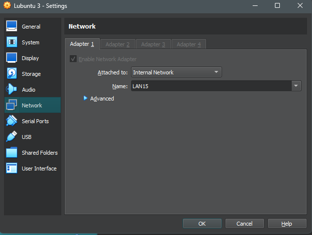
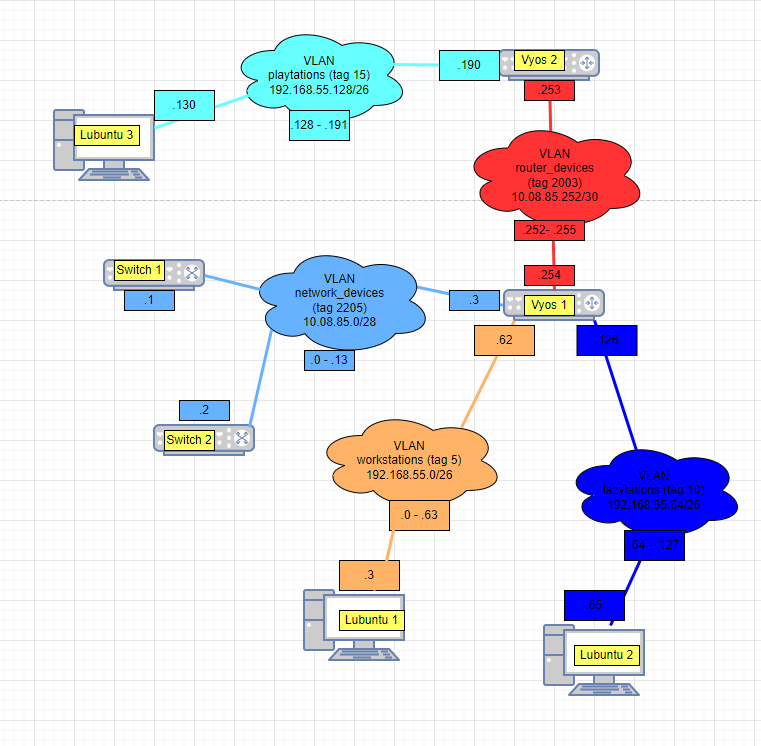

# Documentation for E05

## Luodaan kolmas lubuntu ja toinen vyos

Importattiin uusi lubuntu ja vyos, muunnettiin samalla kaikkien laitteiden nimet loogisiksi

Asetettiin lubuntu 3 ja vyos 2 välinen yhteys adapter 1/port 0 kautta LAN 1 yhteydellä

Asetettiin myös lubuntu 3 ip osoite oikeanlaiseksi

Asetettiin vyos 2 ja vyos 1 välinen yhteys adapter 2 /port 1 kautta LAN 2 yhteydellä

## päivitetty fyysinen- ja looginen topologia

### Fyysinen

### Looginen

## Vyosien osoitteistaminen

Ohessa käytetyt komennot, vyos 1 päinvastaiset eikä siinä ole playstations tagia

## DHCP serverin konfigurointi

Toistetaan sama operaatio kaikille VYOS1:ssä oleville VLANeille (VLAN5 ja VLAN10) paitsi network_devices (VLAN2205).

set service dhcp-server shared-network-name VLAN5 subnet 192.168.55.0/26 default-router 192.168.55.62

set service dhcp-server shared-network-name VLAN5 subnet 192.168.55.0/26 range PCs start 192.168.55.2

set service dhcp-server shared-network-name VLAN5 subnet 192.168.55.0/26 range PCs stop 192.168.55.61
