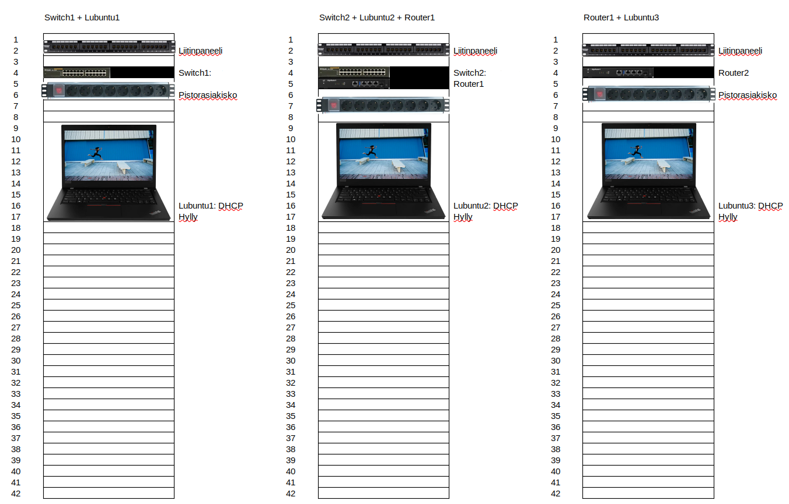

# Documentation for E06

Otetaan kuva fyysisestä topologiasta ajattelun tueksi

## Laitteet

### Reitittimet

<a href="https://www.dustin.fi/product/5011057959/edgerouter-er-4">Ubiquiti EdgeRouter ER-4</a>  
157€/kpl alv 0%

### Kytkimet

<a href="https://www.dustin.fi/product/5010047383/des-1024d-10100-kytkin-24-porttinen">D-Link Des-1024D 10/100</a>  
hinta 41€/kpl alv 0% kytkimen voi asentaa 19" telineeseen mukana tulevalla asennus sarjalla

### Pääteasemat (tietokoneet)

<a href="https://www.dustin.fi/product/5011176390/thinkpad-l490">Lenovo ThinkPad L490</a>   hinta 849/kpl alv 0%

## laite kulut

<table>
<thead>
<tr>
<th>Laite</th>
<th>Määrä</th>
<th>Hinta</th>
</tr>
</thead>
<tbody>
<tr>
<td>Lenovo ThinkPad L490</td>
<td>3kpl</td>
<td>849€</td>
</tr>
<tr>
<td>D-Link Des-1024D 10/100</td>
<td>2kpl</td>
<td>41€</td>
</tr>
<tr>
<td>Ubiquiti EdgeRouter ER-4</td>
<td>2kpl</td>
<td>157€</td>
</tr>
<tr>
<td>Yhteensä</td>
<td></td>
<td>2943€</td>
</tr>
</tbody>
</table>

## Laitekaapit

Ostetaan kytkimiä ja reitittimiä varten 3 kpl 800 x 800, 42U laitekaappeja, hinta 799€/kpl: 
 
<a href="https://www.perel.fi/tuote/v88222412/itk-4288-lk2/it-kaappi-42u-l800-s800-lasiovi/89113199/1">Laitekaapit</a>

1. kaappiin tulee kytkin, reititin ja siihen liitetty PC ja
2. kaappiin tulee kytkin ja pc, lisäksi runsaasti laajennustilaa.
3. kaappiin tulee toinen reititin ja siihen liitetty PC. Otetaan isommat kaapit mahdollista laajenusta varten.

Ostetaan kaappeihin myös pistorasiakiskot, 35€/kpl:
 
<a href="https://www.perel.fi/tuote/v5957806/p3-300-009/pistorasiakisko-19-9-rasiaa-3m/89113199/1">Pistorasiakiskot</a>

ostetaan myös liukuvat hyllyt 83€/kpl
 
<a href="https://www.perel.fi/tuotteet/44357869/19-vetohylly-2u-20-kg-etureunakiinnitys">Vetohyllyt</a>

<table>
<thead>
<tr>
<th>Tuote</th>
<th>Määrä</th>
<th>Hinta</th>
</tr>
</thead>
<tbody>
<tr>
<td>Laitekaapit</td>
<td>3kpl</td>
<td>799€</td>
</tr>
<tr>
<td>Pistorasiakiskot</td>
<td>3kpl</td>
<td>35€</td>
</tr>
<tr>
<td>Vetohyllyt</td>
<td>3kpl</td>
<td>83€</td>
</tr>
<tr>
<td>Yhteensä</td>
<td></td>
<td>2751€</td>
</tr>
</tbody>
</table>

## Kaapelointi

liitinpaneelit joka kaappiin 16,80/kpl
 
<a href="https://www.starelec.fi/product_info.php?cPath=97_798_2024&amp;products_id=25645">Liitinpaneelit</a>

Näihin CAT-6 jatkoliittimiä 3,10/kpl
 
<a href="https://www.starelec.fi/product_info.php?products_id=28872">CAT6-jatkot</a>

Sekä LC/LC-jatkoliittimiä 2kpl, 2€/kpl:
 
<a href="https://www.starelec.fi/product_info.php?products_id=28014">LC/LC-jatkot</a>

kaappien sisäisiin kytkentöihin 2 metrisiä RJ45 S/FTP cat7 kaapeleita cat6A liittimillä. 6.40/kpl
 
<a href="https://www.satshop.fi/rj45-s-ftp-cat7-ethernet-cable-2m.html">Ethernet-kaapelit</a>

olettaen kytkinkaappien olevan samassa rakennuksessi, vaikka 60 metrin etäisyydellä. ostetaan välille kaapeli 100m kela cat7 99,00/kpl
 
<a href="https://www.satshop.fi/tp-70c.html">Ethernet-kaapeli</a>

ostetaan reitittimien välille valokuitukaapeli, jos ne ovat esim eri kerroksissa ja 180 metrin päässä toisistaan. 200m fulldublex LC/LC kuitukaapeli 490€   <a href="https://www.avecom.fi/tuote/avecom-fulldublex-lclc-kuitukaapeli-200m/">Valokuitu-kaapeli</a>

ostetaan kaappeihin lyhyet kuitukaapelit. singlemode 0.5m LC/LC duplex-kaapelit. tarvitaan 2 kpl. 18,90/kpl   <a href="https://www.multitronic.fi/fi/products/1238506/deltaco-kuitukaapeli-lc---lc--duplex--singlemode-os2--0-5m">Valokuitu-kaapelit</a>

reitittimet tarvitsevat myös 2kpl SFP-LC moduuleja LC-kytkentää varten. 40.24/kpl   <a href="https://www.verkkokauppa.com/fi/product/11568/frchh/Datolink-1000M-BIDI-20-km-SFP-lahetin-vastaanotin-moduuli?list=OZCYkRZPgMDZlvBEMqUoDNQiL09socjMqeMb9VvyI5vlR9v">SFP-LC-moduulit</a>

### kuluarvio

<table>
<thead>
<tr>
<th>Tuote</th>
<th>Määrä</th>
<th>Hinta</th>
</tr>
</thead>
<tbody>
<tr>
<td>Liitinpaneelit</td>
<td>3kpl</td>
<td>16,80€</td>
</tr>
<tr>
<td>CAT6-jatkoliittimet</td>
<td>10kpl</td>
<td>3,10€</td>
</tr>
<tr>
<td>LC/LC-jatkoliittimet</td>
<td>2kpl</td>
<td>2,00€</td>
</tr>
<tr>
<td>2m Cat7-kaapelit</td>
<td>5kpl</td>
<td>6,40€</td>
</tr>
<tr>
<td>100m Cat7-kela</td>
<td>1kpl</td>
<td>99,00€</td>
</tr>
<tr>
<td>200m valokuitukaapeli</td>
<td>1kpl</td>
<td>490€</td>
</tr>
<tr>
<td>0,5m valokuitukaapelit</td>
<td>2kpl</td>
<td>18,90€</td>
</tr>
<tr>
<td>SFC-valokuitumoduulit</td>
<td>2kpl</td>
<td>40,24€</td>
</tr>
<tr>
<td>Yhteensä</td>
<td></td>
<td>825€</td>
</tr>
</tbody>
</table>

## kytkennät

Kaappi 1:
Liitinpaneeli port 1 - Switch1 port 1
Switch1 port 2 - Lubuntu1 eth0

Kaapin 1 ja 2 väli:
Liitinpaneeli port 1 - Liitinpaneeli port 1

Kaappi 2:
Liitinpaneeli port 1 - Switch2 port 1
Switch2 port 2 - Lubuntu2 eth0
Switch2 port 3 - Router1 eth0
Liitinpaneeli port 24 - Router1 eth3 SFC-module

Kaapin 2 ja 3 väli:
Liitinpaneeli port 24 - Liitinpaneeli port 24

Kaappi 3:
Liitinpaneeli port 24 - Router2 eth3 SFC-module
Router 2 eth0 - Lubuntu 3 eth0

## asennukset

