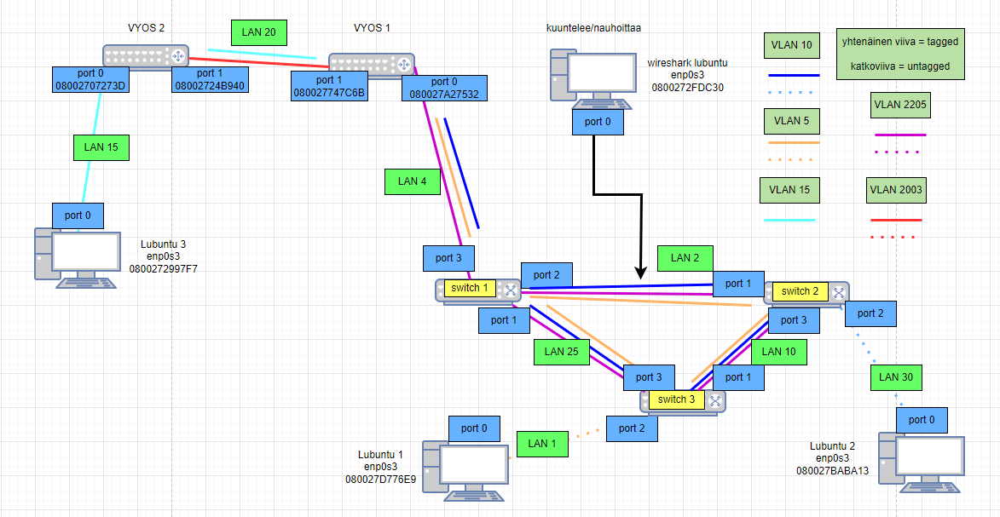
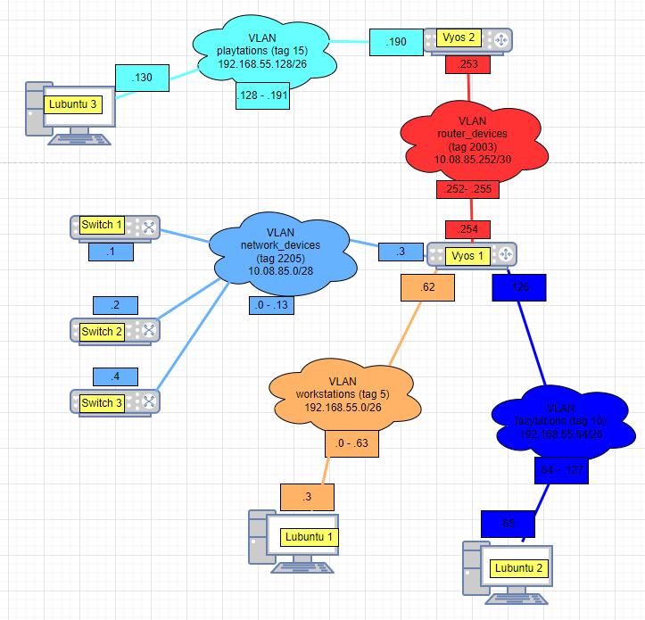
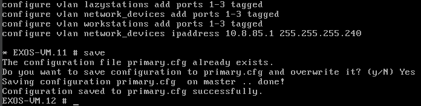
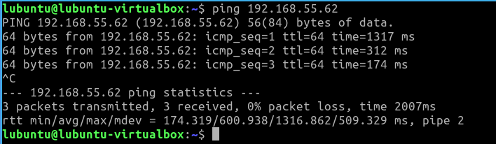
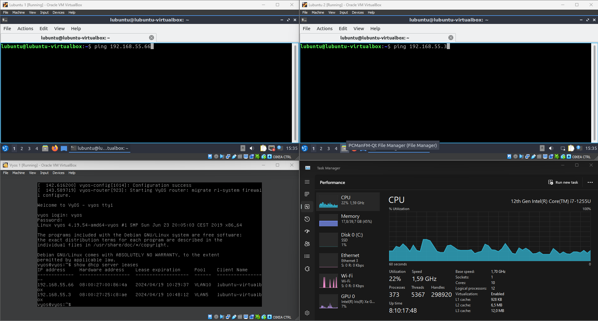
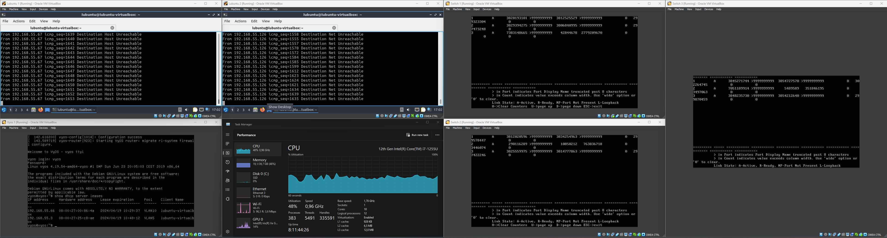
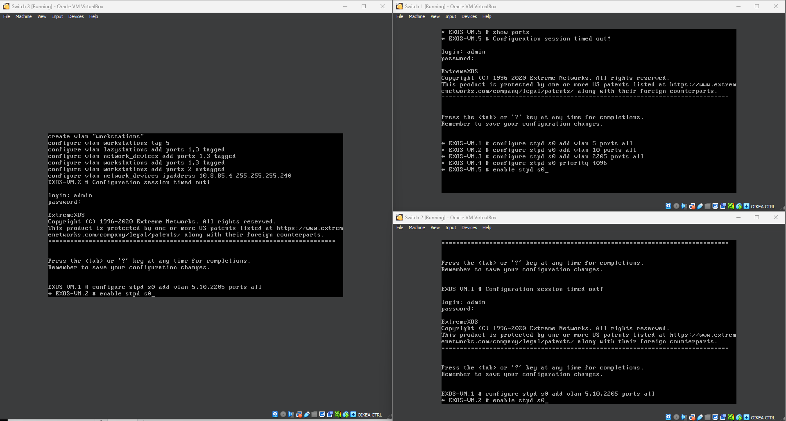
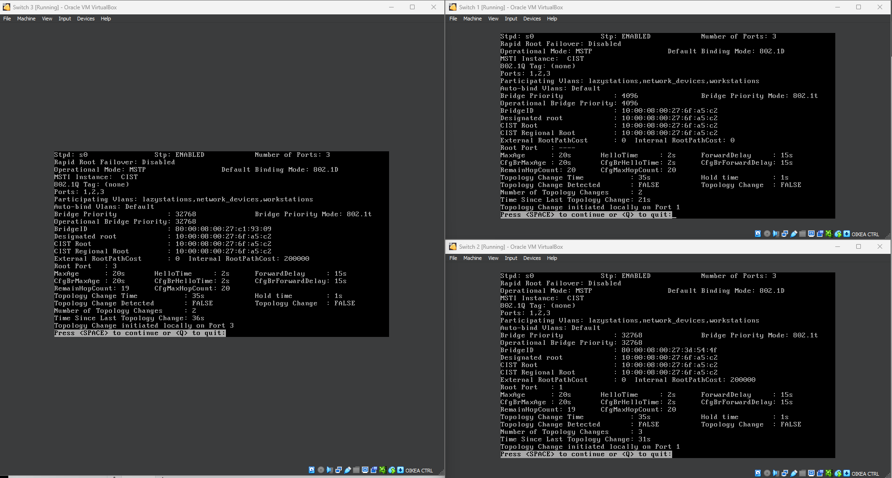
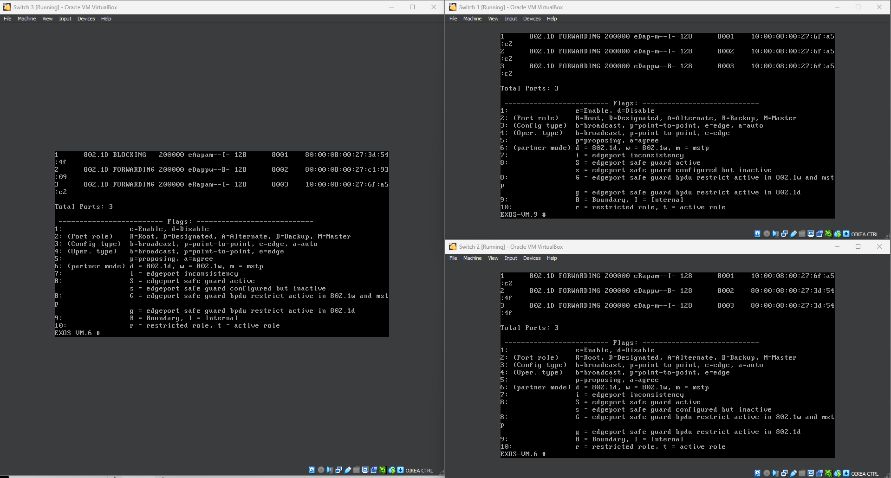

# Documentation for E07

## Aloitetaan muokkaamalla topologiat

### Fyysinen topologia

### Looginen topologia

## Uudelleen konfiguroidaan kytkimet 1&2

### Switch 1

### Switch 2

## Siirrettään lubuntu 1 switch 3 taakse

Kytkin 3 on kopioitu kytkimestä 2, joten osa conffauksista pitää poistaa

## Yhteystestaukset lubuntuilla oletusyhdyskäytäviin

Harjoituksessa oletetaan, että vyos on kytketty switch 2:een, mutta minulla kun se on switch 1:ssä niin pitää soveltaa sen ympäri.

### Lubuntu 1

Kytkimet ja 1 ja 3 päällä, 2 pois päältä.

Lubuntu 1 ping sen oletusyhdyskäytävään 912.168.55.62

### Lubuntu 2

Kytkimet 1 ja 2 päällä, 3 pois päältä

Lubuntu 2 ping sen oletusyhdyskäytävään 192.168.55.126

## Silmukka

Ennen silmukan käynmnistämistä tilanne tämä (vertailu mielessä sisällytetty)

laitetaan silmukka päälle

Kuten näkyy on kytkinten packet transmitit pilvissä ja prosessorin käyttöaste on selvästi kohonnut.

## Spanning tree protokolla

konfiguroidaan ja käynnistetään stp kaikissa kytkimissä ja VLANeissa. Kytkin 1 on juurikytkin.

show stpd s0

show stpd s0 ports

