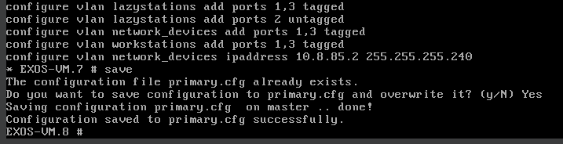
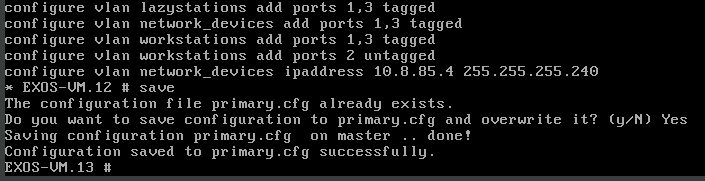

# Documentation for E07

## Aloitetaan muokkaamalla topologiat

### Fyysinen topologia

### Looginen topologia

## Uudelleen konfiguroidaan kytkimet 1&2

### Switch 1

### Switch 2

Tarkistetaan välissä, että oletusyhdyskäytävät lubuntu 1&2 välillä toimivat yhä (kun kytkin 3 on vielä pois päältä)

## Siirrettään lubuntu 1 switch 3 taakse

Kytkin 3 on kopioitu kytkimestä 2, joten osa conffauksista pitää poistaa

