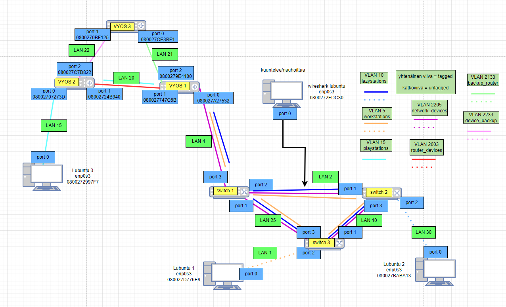
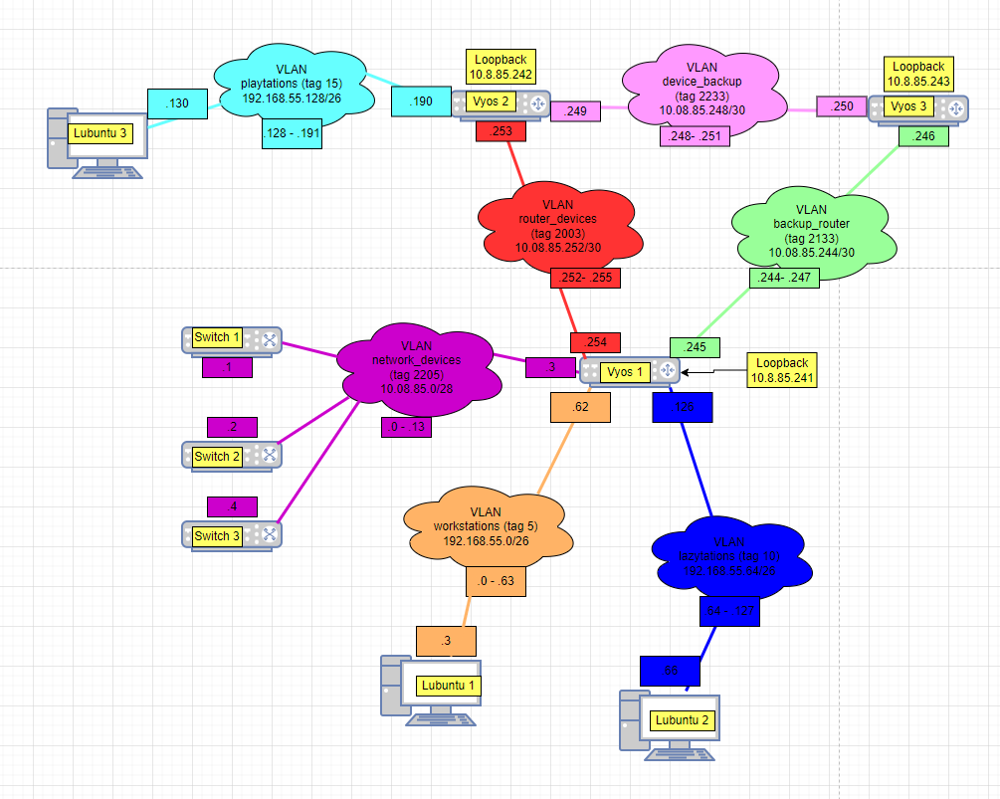

# Documentation for E08

Otetaan käyttöön seuraavat kahden päätelaiteosoitteen aliverkkoa.

R1-R2 kulkee 10.8.85.252-.255 (verkon osoite ja broadcast sisällytettynä)

R2 ja R3 kulkee 10.8.85.248-.251 jolloin .249 ja .250 ovat päätelaiteosoitteet

R3 ja R1 kulkee 10.8.85.244-.247 jolloin .245 ja .246 ovat päätelaiteosoitteet.

Päivitetään nämä tiedot topologioihin

## Topologiat

### Fyysinen topologia

### Looginen topologia

## Kolmas Vyos

Kloonattiin kolmas vyos (Vyos 2 pohjalta) ja asetettiin siihen (ja muihin vyoseihin) topologioiden mukaiset asetukset.

## Kaikkien Vyosien asetukset

## Loopback rajapinnat

### Uusi kahden päätelaiteosoitteen aliverkko

Otetaan seuraava mahdollinen: 10.8.85.240-.243 (/30)

Jaetaan kullekin reitittimelle tästä loopback osoitteet. 
R1: 10.8.85.241 
R2: 10.8.85.242 
R3: 10.8.85.243 

Valitaan nämä, koska osoitteen viimeinen numero samalla kertoo mistä reitittimestä on kyse.

### Konfiguroidaan nämä rajapinnat reitittimiin

## OSPF konfigurointi
