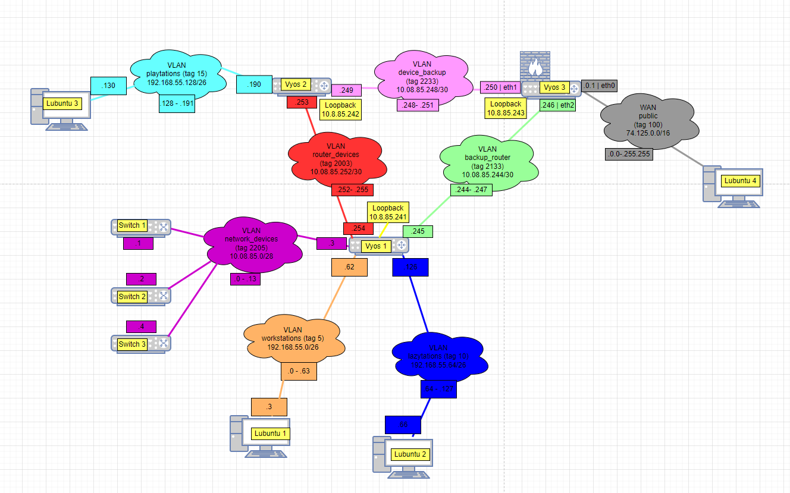
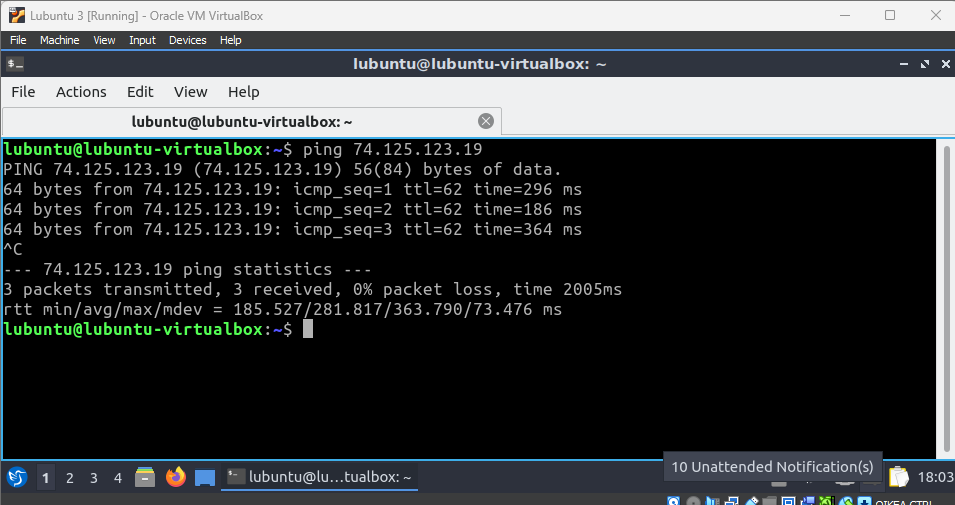
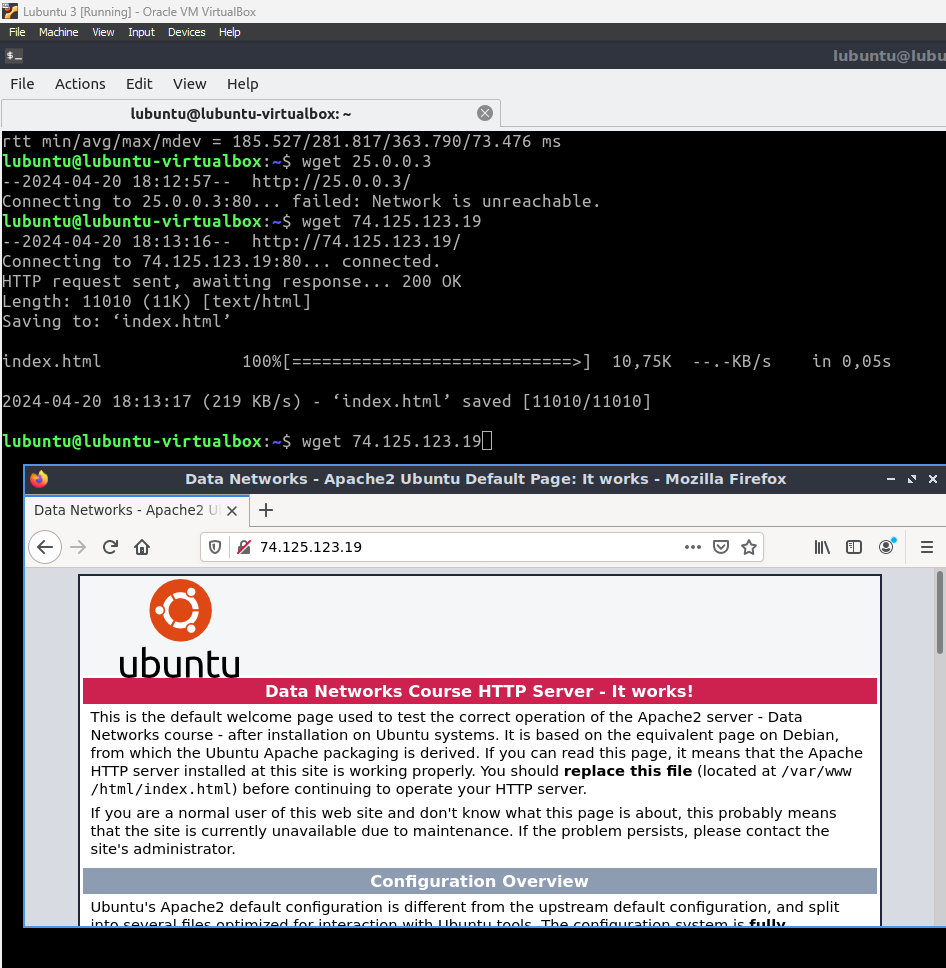
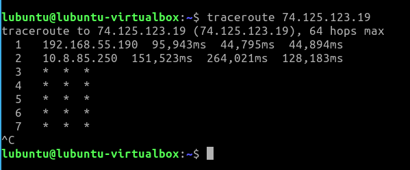
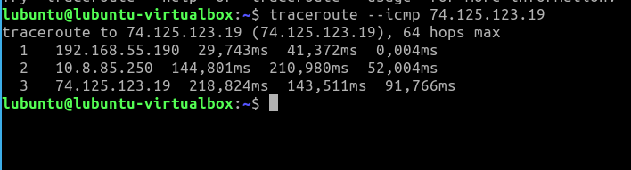
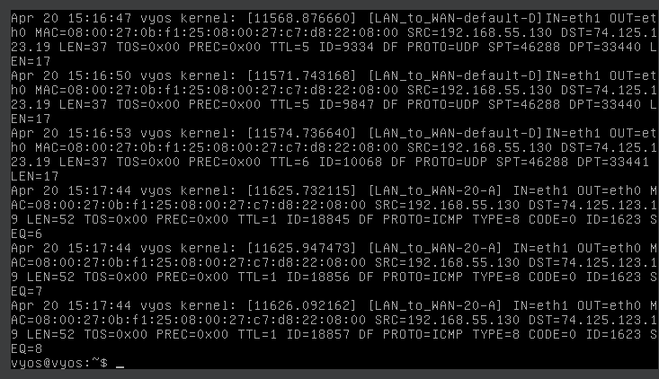
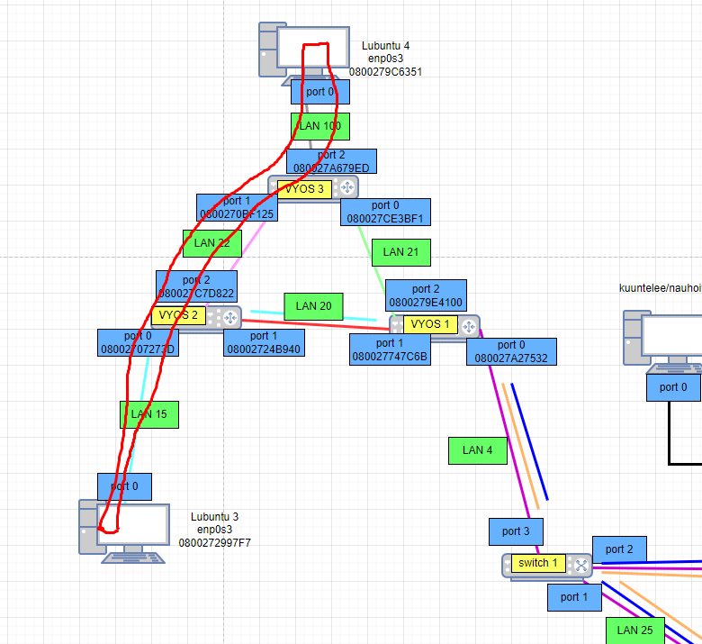
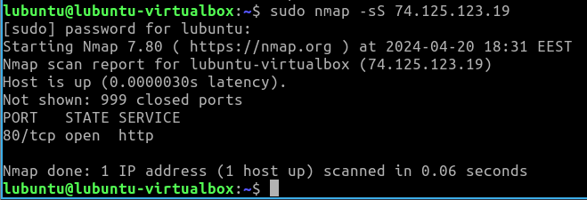

# Documentation for E09

Lähdetään liikkeelle siitä, että kloonataan Lubuntu 3:stä Lubuntu 4 ja asetetaan sille ja Router 3:n eth2:lle 'Public'-adapterit. Sen jälkeen asetetaan Router 3:lle DHCP Public-aliverkkoa varten. Tässä vaiheessa pitäisi valita julkinen osoiteavaruus tätä aliverkkoa varten. Valitaan tähän vaikkapa Googlen julkinen aliverkko '74.125.0.0/16', ja näin ollen asetetaan Router 3:n eth0:an (LAN100) IP 74.125.0.1. Lisätään Router 3:lle tuki DHCP:lle tälle aliverkolle ja lisätään se OSPF:n listoille. Muutetaan myös OSPF:n osalta eth3 passiiviseksi, ettei jaeta julkisesti omia reitityksiä.

## Konfiguroidaan palomuuria

Tehdään materiaalien mukainen luvitus palomuuriin

   Tämän tiedoston komennot sisältyy myös vyos3.cfg tiedostoon palautuksen lopussa.

## Topologiat

### Fyysinen

### Looginen

## Yhteystestaukset

Pingataan lubuntu 3 to lubuntu 4

Tämä toimii ja riittää. Kysytty apua teams kanavalla ja Pasi sanoi että OK.

### Vyos confit

### Toimivuustodennuksia

http ja wget L3-L4

traceroute: ensin ei toimi, sitten toimii, koska palomuuri estää UDp yhteyden

Loki kuvassa ekana näkyy "default-D" mikä on epäonnistunut traceroute ja sitten näkyy onnistuneita yhteyksiä.

Karttaan on punaisella piirretty reitti mitä pitkin yllä mainitut yhteydet on testattu.

NMAP

