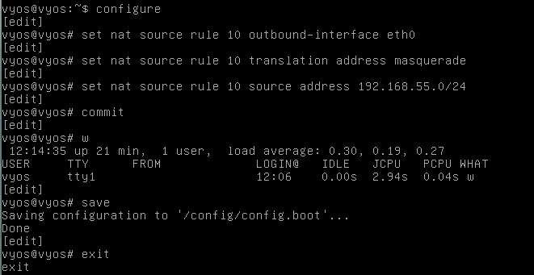

# Documentation for E10

Ei poisteta vielä palomuuria käytöstä, koska tekohetkellä tehtävät E07-E09 odottaa vielä hyväksyntää. Joten jos E09 tarvitsee korjausta, niin ei tarvitse uudelleenkonfiguroida palomuuria.

## Many-to-1 NAT

Muistetaan edellisestä tehtävästä, että eth0 vastaa public-verkkoon menevää porttia, joten voimme käyttää materiaalien komentoja sellaiesenaan. Tehtävässä siis piilotetaan muiden lubuntujen osoitteet yhden verkon taakse.

### Lubuntujen osoitteet

Lubuntu 1: 192.168.55.0/26 
Lubuntu 2: 192.168.55.64/26 
Lubuntu 3: 192.168.55.128/26

Annetaan näille yhteinen "super"aliverkko: 
192.168.55.0/24

### Komennot

set nat source rule 10 outbound-interface eth0 
set nat source rule 10 translation address masquerade 
set nat source rule 10 source address 192.168.55.0/24 

Tuo "w" oli misinput eikä käsittääkseni vaikuta mihinkään.
