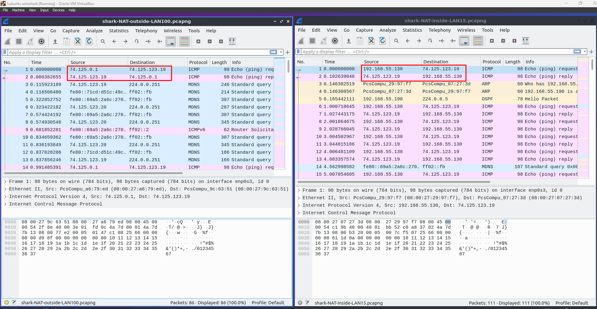

# Documentation for E10

Ei poisteta vielä palomuuria käytöstä, koska tekohetkellä tehtävät E07-E09 odottaa vielä hyväksyntää. Joten jos E09 tarvitsee korjausta, niin ei tarvitse uudelleenkonfiguroida palomuuria.

Ei tarvitse myöskään muuttaa topologioita, joten edellisen tehtävän kuvat pätee yhä.

## Many-to-1 NAT

Muistetaan edellisestä tehtävästä, että eth0 vastaa public-verkkoon menevää porttia, joten voimme käyttää materiaalien komentoja sellaiesenaan. Tehtävässä siis piilotetaan muiden lubuntujen osoitteet yhden verkon taakse.

### Lubuntujen osoitteet

Lubuntu 1: 192.168.55.0/26

Lubuntu 2: 192.168.55.64/26

Lubuntu 3: 192.168.55.128/26

Annetaan näille yhteinen "super"aliverkko:

192.168.55.0/24

Switch 1: 10.8.85.1/30

Switch 2: 10.8.85.2/30

Switch 3: 10.8.85.4/30

Annetaan näille yhteinen "super"aliverkko:

10.8.85.0/28

### Komennot

set nat source rule 10 outbound-interface eth0

set nat source rule 10 translation address masquerade

set nat source rule 10 source address 10.8.85.0/26

set nat source rule 11 outbound-interface eth0

set nat source rule 11 translation address masquerade

set nat source rule 11 source address 192.168.55.0/24

## Yhteystestaukset

Pidettiin L3:lta L4:lle ping kokoajan päällä ja katseltiin wiresharkilla mitä näkyy

Huomataan että kun katsotaan ulkopuolelta (vasen puoli), niin "from" osoite on Vyos 3 rajapinnan osoite, kun taas sisäpuolelta (oikea puoli) katseltuna "from" osoite on lubuntun oma osoite.

### Conf tiedosto

