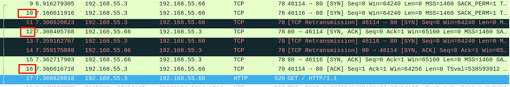
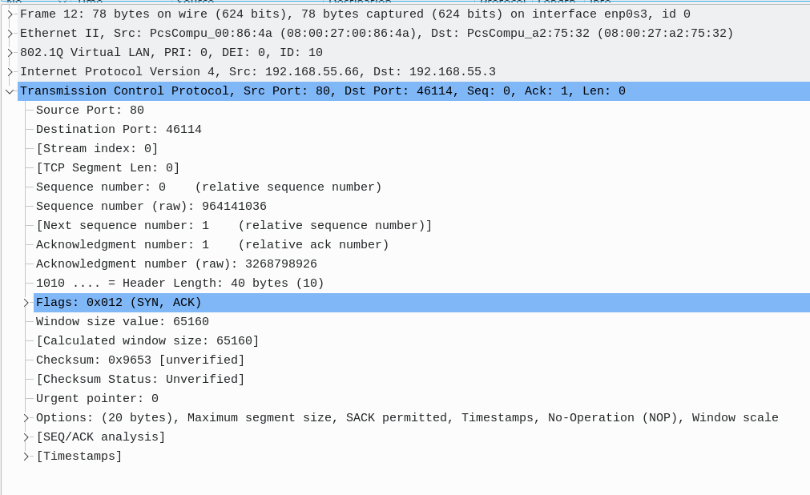

# Documentation for E11

## Muunnetaan lubuntu oikeaan verkkoon

Eli bridged adapter... Siirretään Lubuntu 1 käyttämään sitä

### Testaillaan iperf yhteyksiä

toimii!

En saanut toimimaan käsketyllä portilla enkä muullakaan portilla. Google ehdotti, että .

iperf toimii myös intervallitetulla ajastuksella

Iperf toimii portilla ja UDP:lla

Iperf toimii pelkällä portilla

Iperf toimii pelkällä UDP:lla

### Pohdinnat

Portilla 5201 ei toimi, mutta UDP:n kautta toimii oletetuilla nopeuksilla.

## Lubuntusta iperf palvelin

Aletaan siirtämällä testaukseen käytetty lubuntu takaisin sisäverkkoon

Lubuntut saa toisiinsa yhteyden. Valitaan Lubuntu 2 olemaan iperf-palvelin

Lubuntu 2:sta tuli onnistuneesti iperf palvelin ja lubuntu 1 pystyi ottamaan siihen yhteyden ja lubuntu 2 vastasi asianmukaisesti.

intervalli yhteys ja udp yhteys onnistuvat sisä iperf:llä

Iperf yhteys onnistuu ilman erikseen portin nimeämistä

### Serverin näkökulmasta samat

Tässä iperf palvelimen näkökulman viestejä

## Wireshark TCP

Sitten etsitään Wiresharkilla 3-way-handshake TCP-yhyeydestä. Tässä ensin kokonaisuudessaan segmentit. Punaisella merkityt on halutut segmentit

Sitten 1. segmentti:

source port on lubuntu 1 (asiakaskone) portti 45115 ja destination port on iperfin portti 80. Sequence on 0

Nyt source ja destination portit ovat käänteiset kun äsken lähetettyyn "kyselyyn" vastataan. Acknowledgement numero nousee ykköseen ja seq on edelleen 0

Nyt portit ovat taas alkuperäisessä asennossa ja sequence numero on noussut, kun yksi sekvenssi on suoritettu

## Wireshark UDP

Kuvassa DHCP kättelyn molemmat segmentit punaisella merkittynä

DHCP request pyytävä osapuolen source on 0.0.0.0 ja DST on 255.255.255.255, koska DHCP palvelin ei ole vielä jakanut oikeita osoitteita. SRC portti on 68 ja DST portti on 67

DHCP ACK vastaus, että IP annetaan ja kuvasta näkyy, että 0.0.0.0 on muuttunut 192.168.55.62:ksi ja 255.255.255.255 on muuttunu 192.168.55.3:ksi. Tässä myös SRC ja DST porttien paikat ovat vaihtuneet
