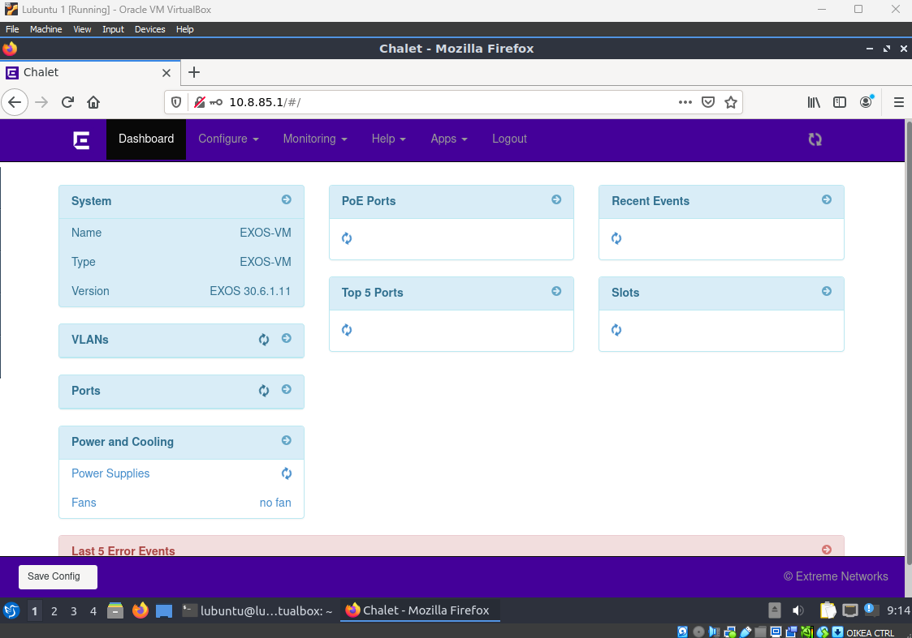
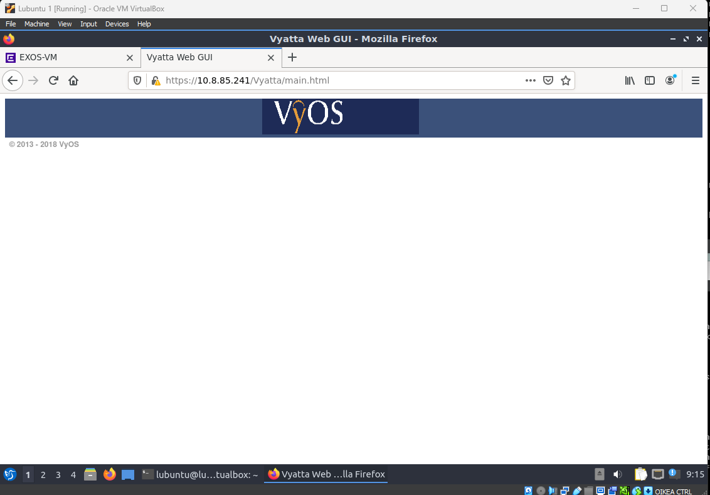

# Documentation for E12

## Konfiguraatiot

## Verkkolaitteiden web-palvelimet

### Kytkin

#### Mitä voin konfiguroida nettisivulla?

Graafisesti kaiken sen mitä olen tähän mennessä CLI:n kautta tehnyt

### Reititin

#### Mitä voin konfiguroida nettisivulla?

En juurikaan mitään, koska verkkosivulla "ei ole mitään"
