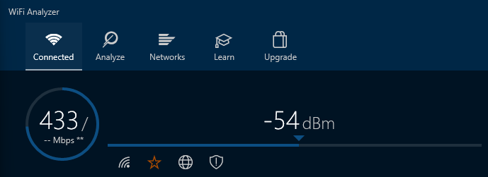

# Documentation for E14

Tehdään optio 2 eli Wifi analyzerin avulla

## Yhteys WLAN hallintapaneeliin

Onnistuu 192.168.0.1 kautta

oletusyhdyskäytävä "sisäverkossa" on 192.168.0.104

Oletusyhdyskäytävän kautta ei saa yhteyttä

Käyttäjänimi on Admin ja salasana oli Admin, mutta olen muuttanut sen omatoimisesti ennen kurssia. Nämä tiedot lukee myös modeemin pohjassa.

## WLAN tutkimus

yleiset asetukset 5 GHz verkolle

Tästä saisi muutettua WLANin kanavan

Tästä saa muutettua kanavan leveyden

### LAN

ALiverkkoni on 192.168.0.1 ja osoitetta voi halutessaan muuttaa.

### DHCP

Minulla on konfiguroitu DHCP palvelin käytössä, koska tietokoneeni toimii ajoittain myös minecraft serverinä.

### Asetukset

Asetuksia on niin paljon, että pää menee pyörälle. TP-link ainakin on sisällyttänyt oikeaan sidebariin ohjeita mitä mikäkin tekee

