# Documentation for E15

Siirretään lubuntu 1 pois sisäverkosta käyttäen bridged adapteria

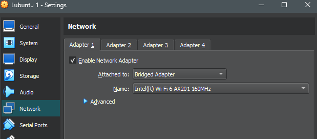

## DNS internetissä

Avatiin lubuntulla wireshark ja käynnistettiin tallennus. Samalla laitettiin terminaaliin komento dig +trace student.labranet.jamk.fi

Kun komento oli valmis, niin keskeytettiin ja tallennettiin wireshark tallennus. Nyt tarkastellaan tätä tallennetta sekä komentokehotteen tulostetta

### Kehote ja tuloste

Tässä kehote kokonaisuudessaan

Ensimmäiseltä palstalta löytyy root-serverit '.'.

Root serveriltä c. osoitteessa 192.33.4.12 löytyy toinen palsta, josta nähdään Suomen DNS-palvelimet '.fi'.

Sieltä saadaan vastaus k.fi palvelimelta osoitteesta 213.186.229.226, että 'jamk.fi':n DNS-palvelimet löytyvät osoitteista jazz.jypoly.fi, tango.jypoly.fi ja humppa.jypoly.fi.

Lopuksi saadaan vastaus jazz.jpoly.fi palvelimelta osoitteesta 195.148.128.19, että student.labranet.jamk.fi löytyy osoitteesta 195.148.26.130.

## Esitään ko. paketit wiresharkista

DNS aloittaa kysymällä mitä root-palvelimia on käytössä. Tässä vaiheessa ei vielä kysytä, että mistä student.labranet.jamk.fi löytyy.

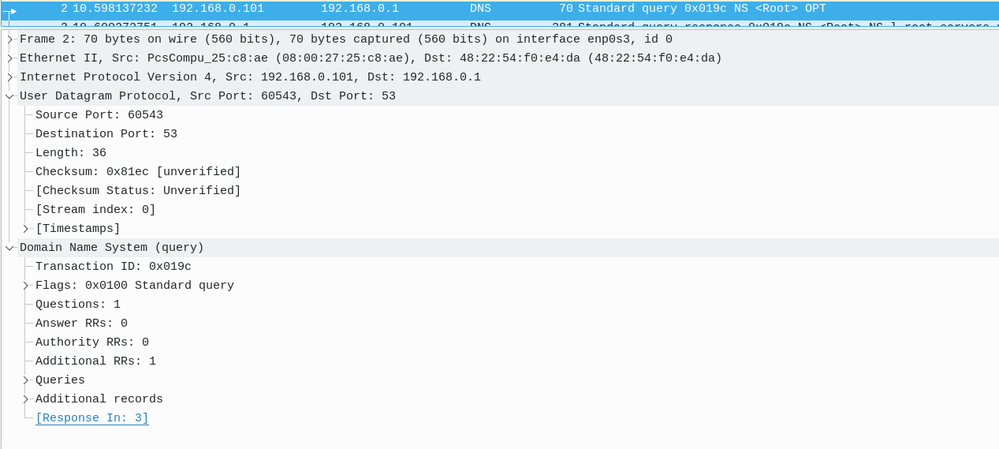

Tähän saadaan vastaus. Vastauksesta löytyy kymmenkunta palvelinta, joista jokaisesta tehdään jatkokyselyt

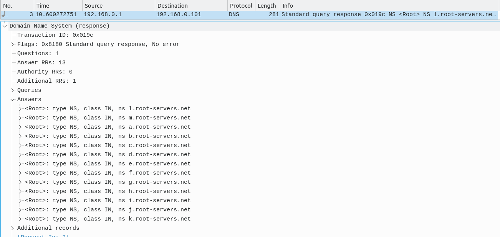

Aletaan sitten tekemään kyselyitä eri palvelimille, että mistä student.labranet.jamk.fi löytyy

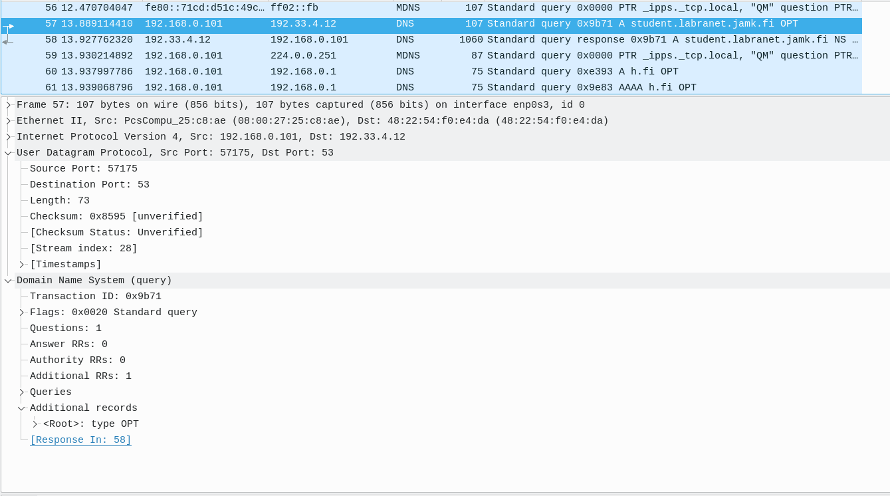

Lopulta saadaan vastaus, että osoite löytyy .fi alta ja antaa tarjolle .fi palvelimia mistä tehdään jatkokyselyitä

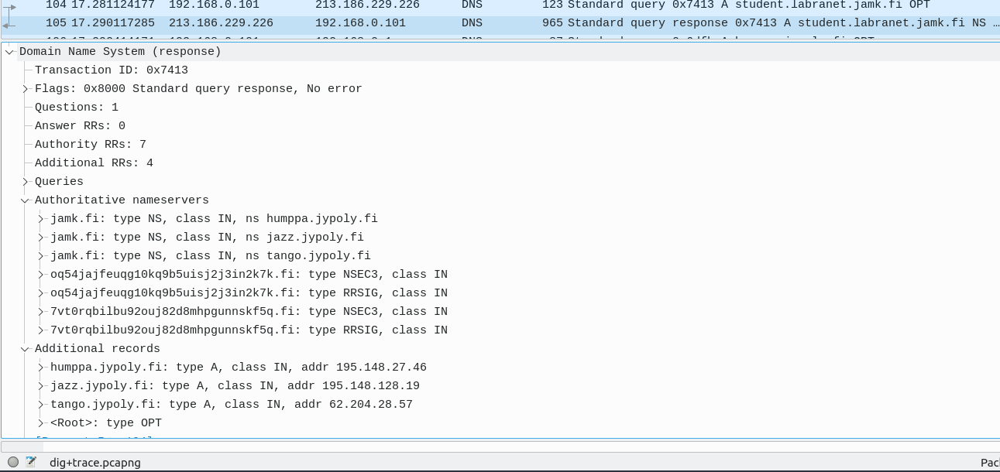

ALetaan sitten tekemään jatkokyselyitä

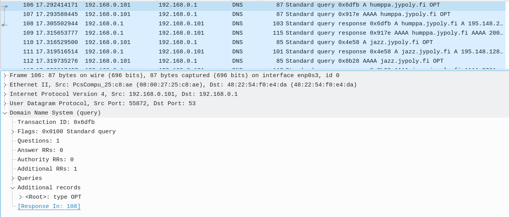

saadaan vastaus osoitteelta 213.186.229.226 että jamk.fi osoite löytyy DNS-palvelimien jazz, tango tai humppa.jypoly.fi alta. Joten lähdetään kyselemään taas tarkemmin.

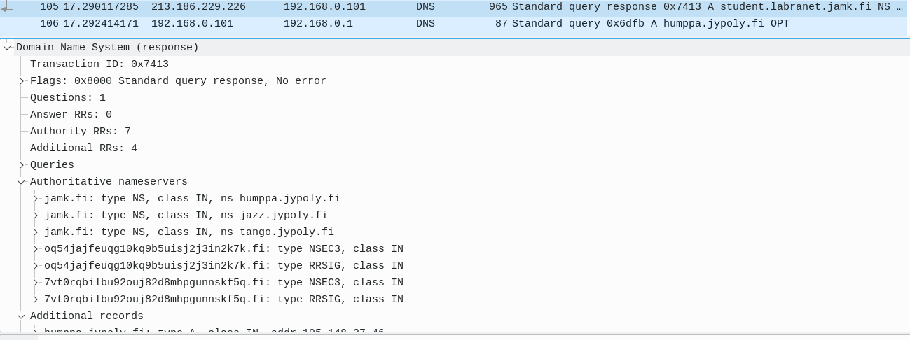

Lopuksi löydetään, mistä saadaan jamk.fi loppuiset osoitteet ja löydetään student.labranet.jamk.fi

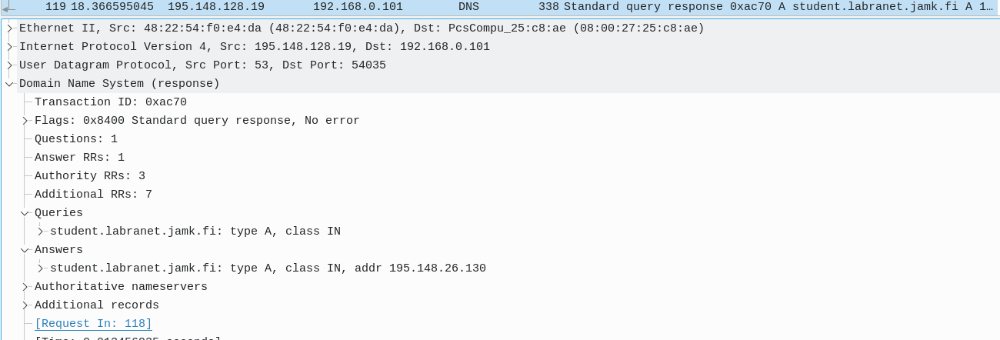

Osoitteesta 195.148.128.19 kerrotaan, että haettu osoite on tyyppiä A ja löytyy osoitteesta 195.148.26.130

## DNS topologiassa

Nyt aletaan nimeämään oman topologian laitteita

Aloitetaan siitä, että muokataan /etc/hosts tiedostoa ja lisätään sinne nimet osoitteille. Otetaanpa ihan aluksi IP:t ylös ja keksitään laitteille nimet.

Lubuntu 1: 192.168.55.3 - lubuntu1.akseli.larikka 
Lubuntu 2: 192.168.55.66 - lubuntu2.akseli.larikka 
Lubuntu 3: 192.168.55.130 - lubuntu3.akseli.larikka 
Lubuntu 4: 74.125.123.19 - lubuntu4.akseli.larikka 

Switch 1: 10.8.85.1 - switch1.akseli.larikka 
Switch 2: 10.8.85.2 - switch2.akseli.larikka 
Switch 3: 10.8.85.4 - switch3.akseli.larikka 

(Käytetään Vyoseihin loopback osoitteita)

Vyos 1: 10.8.85.241 - vyos1.akseli.larikka 
Vyos 2: 10.8.85.242 - vyos2.akseli.larikka 
Vyos 3: 10.8.85.243 - vyos3.akseli.larikka

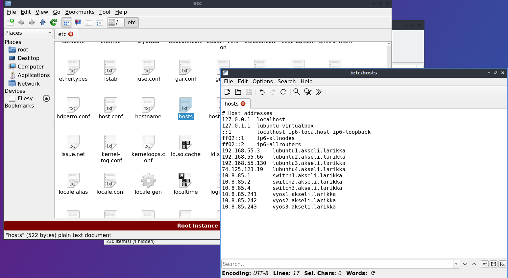

Laitetaan samat hostname tiedot kaikkiin lubuntuihin

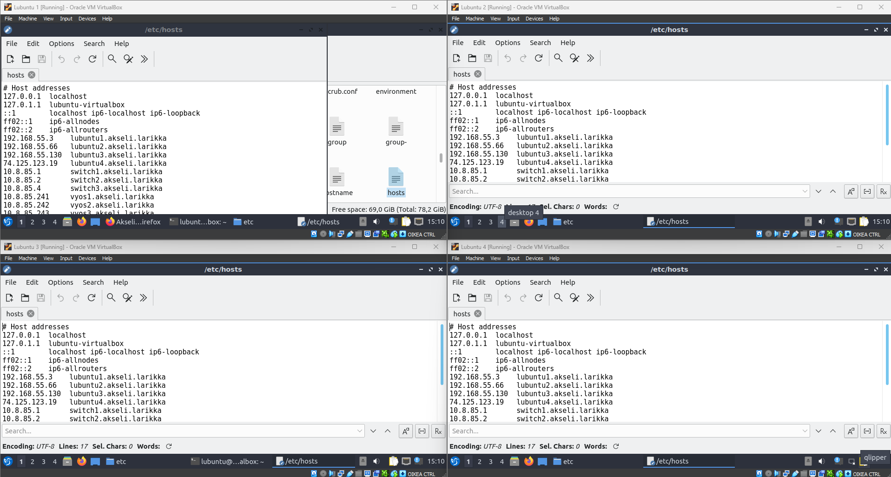

Siirretään host tiedosto www kansioon

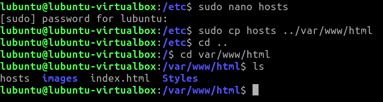

Pienen suostuttelun jälkeen saamme firefoxin uskomaan, että haluamme käyttää juuri luotua domain namea

Otetaan ssh yhteys lubuntu 1:ltä vyos 1:lle

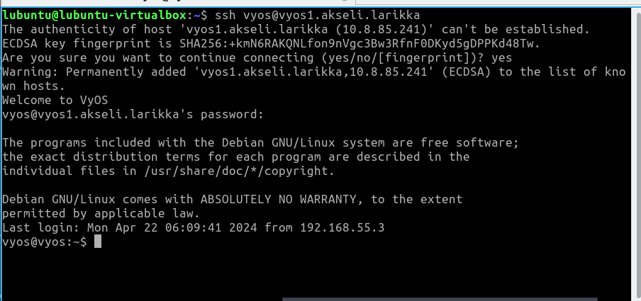

Kokeillaan vielä pingiä

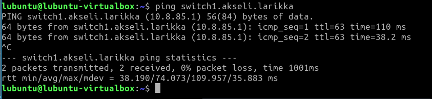

Katsotaan vielä traceroute

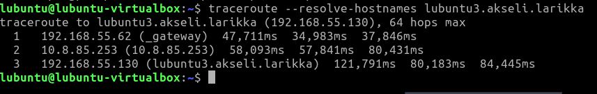

Huomataan että reitittimelle ei ole nimeä, ksoak traceroute näyttää rajapinnan eikä loopbackin osoitteen