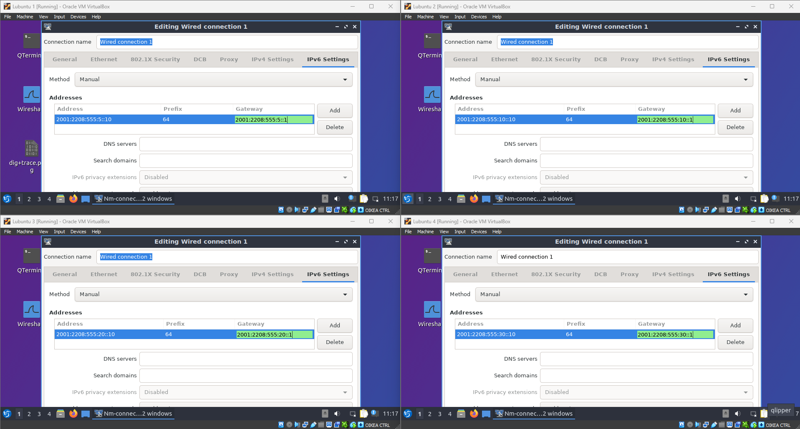
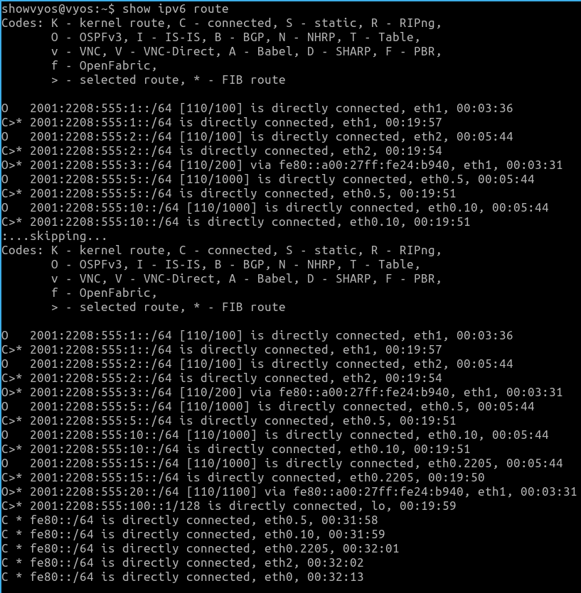
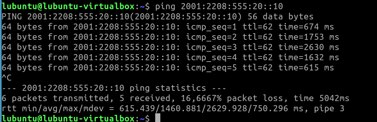
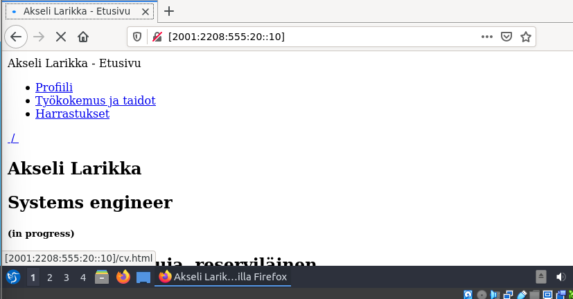
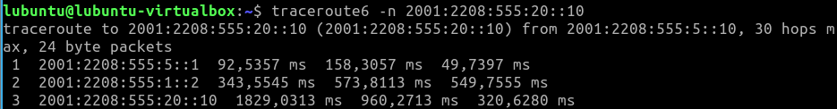

# Documentation for E16

Muistetaan E03:sta...

"Opiskelijanumero on
2208555
ja se on muodossa
vvxyzki"

Muodostetaan sen avulla IPv6 osoite

```
2001:<vvxy>:<zki>:<subnets>::/64
2001:2208:555:<subnets>::/64
```
Kokonaisuudessaan osoite olisi
```
2001:2208:0555:0000:0000:0000:0000:0000
```
Josta 16-bittiä (ensimmäinen 0000) on varattu aliverkkoa varten ja 64-bittiä (jälkimmäiset neljä 0000) hostin osoitetta varten.

Osoiteavaruus kokonaisuudessaan siis olisi 0-ffff

## Päivitetty looginen topologia


## Lisätään IPv6 IP:t

### Lubuntut

Asetetaan IPv6 osoitteet lubuntuille manuaalisesti



### Reitittimet

Komennot:

#### Todiste toimivuudesta SSH yhteys IPv6 osoitteella


### OSPFv3 reitittimille

Komennot:

#### Todiste toimivuudesta

show ipv6 route



## Yhteystestaukset

Ping



HTTP-serveri



SSH testattu aiemmin

Traceroute



DNS


## Konfiguraatiotiedostot reitittimistä


