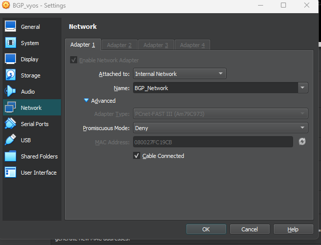
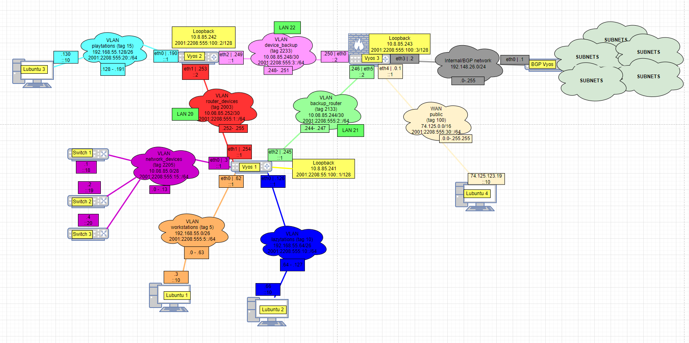
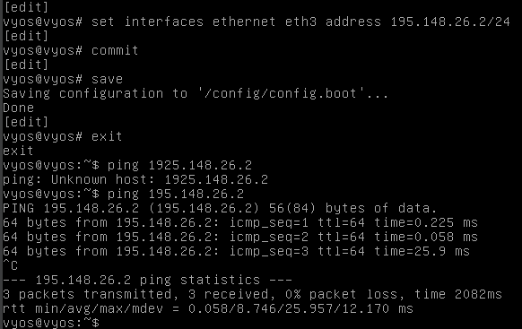

# Documentation for E17

## Vaihtoehto 3, BGP Vyos

Ladataan ja importataan BGP vyos. Varmistetaan samalla, että MAC osoite on oikea.

Vaihdettiin myös Vyos 3 adapter 4 internal network / Bgp network

## Fyysinen topologia

## Vyos 3 conf

