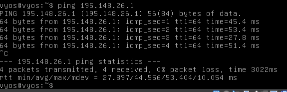

# Documentation for E17

## Vaihtoehto 3, BGP Vyos

Ladataan ja importataan BGP vyos. Varmistetaan samalla, että MAC osoite on oikea.

Vaihdettiin myös Vyos 3 adapter 4 internal network / Bgp network

## Looginen topologia

## Vyos 3 conf

### BGP konfiguraatio

Vyos 3 rajapinnan IP BGP:tä kohti: 195.148.26.2
BGP-Vyos rajapinnan IP Vyos 3:sta kohti 195.148.26.1

Opiskelijanumero on 2208555

Komennot (syötetään vyos 3:een):

set protocols bgp 2208555 neighbor 195.148.26.1 remote-as 65001

set protocols bgp 2208555 address-family ipv4-unicast network 195.148.26.0/24

set protocols bgp 2208555 address-family ipv4-unicast redistribute ospf

set protocols ospf redistribute bgp metric-type 2

Komennot (syötetään BGP Vyos:iin):

set protocols bgp 65001 neighbor 195.148.26.2 remote-as 2208555

set protocols bgp 65001 address-family ipv4-unicast network 195.148.26.0/24

set protocols bgp 65001 address-family ipv4-unicast redistribute ospf

set protocols ospf redistribute bgp metric-type 2

## Yhteystestaukset

Kaikki toimii :)
